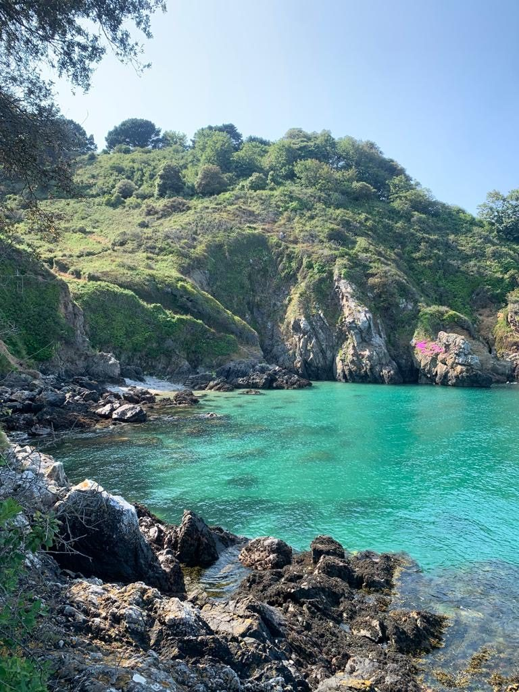
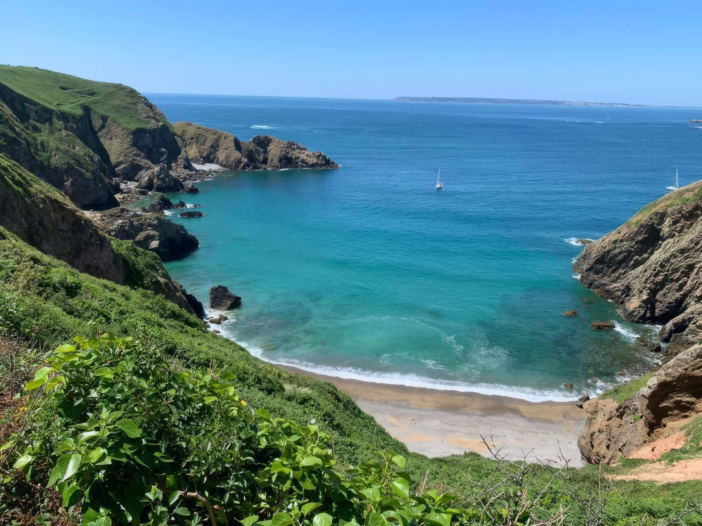
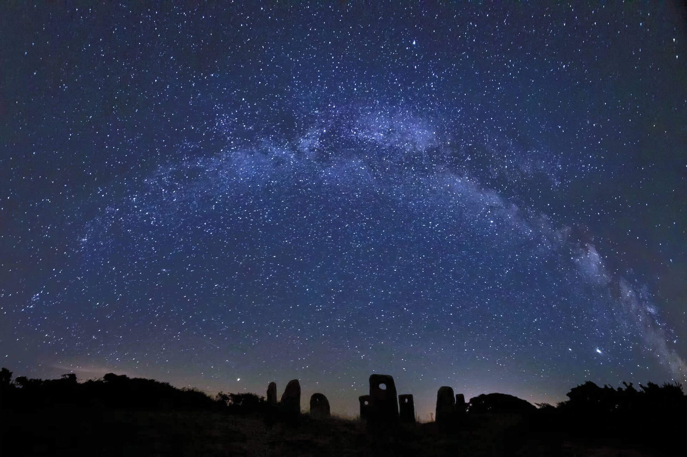

> "To know Sark thoroughly would take a lifetime of holidays."
>
> La Trobe, 1914

Many people think they can give Sark an afternoon. They walk a lane, photograph the cliffs, and catch the last boat back with the nagging feeling they have missed most of the island entirely.

Sark is a glorious day trip from Guernsey, but one day simply does not do it justice.

It seems a tiny island, barely three miles long and a mile and a half wide, yet it hides an enchanting coastline of over forty miles, riddled with caves, arches and coves that take years to know.

Distance here is measured in time, not miles, and nothing is hurried. The island sets the pace, and you will quickly find yourself benefiting from the experience of island time. It begins on [the boat journey](/journal/the-crossing). It's impossible not to look up and take in the natural beauty around you.

Within an hour or two you will stop checking that phone so much, usually without noticing.

Pack soft, and light. You'll need less than you think. The island runs on layers, good shoes and a free evening.

*Spring on the coast path, the island rewards those who stay to explore.*

## The harbour, the climb, and the carters

You don't land at the village. You land at the foot of a cliff. Sark is in effect one high plateau ringed by them, and its summit at Le Moulin is the highest point in the whole Bailiwick of Guernsey.

Maseline is the working harbour, usable at any tide. Creux, around the headland, is the older one, a small walled cove the islanders cut in the 1580s, kept now for the rare days the wind shuts Maseline. From either, the only way is up: twenty minutes on foot through a wooded valley, or the tractor-drawn bus everyone calls the toast rack.

*A Sark cove, no cars have ever run here.*

The toast rack has a good story behind it. For centuries the climb was made on foot or by horse, until the 1970s, when the crowds grew and someone took pity on the horses hauling load after load up the hill. The tractor took the heavy work; the horses still meet you at the top for the gentler journey on.

Leave it to the carters. You won't carry your bags up. Label them, leave them on the quay, and they find their own way to you. Your only job on arrival is to get yourself to the top.

## Around her coast, by boat

> "The bathing, the rocks, the pools, and the climbing are so varied and charming that the visitor is at first almost bewildered in the midst of so great a profusion of delights."
>
> La Trobe, 1914

Much of Sark's coast has no path. The great sea caves, the arches, the caverns at the waterline: you reach them only from the water. In [the La Trobes' day](/journal/the-crossing) the trip round the island meant a rowing boat, two boatmen and most of a day. Now it is a little over two hours with the Guille family, who have run these waters for generations, leaving from Creux twice a day in season. The trip runs today aboard the Dorado, rebuilt for the purpose in 2024.

*The coast that has no path, reached only from the sea.*

It is also the gentler way to see the coast, and in season the wildlife comes with it: puffins, guillemots, dolphins, seals, the occasional basking shark. The tide does the rest. With a ten-metre range, no two trips are alike; some days you slip into the caves, others you nearly touch the offshore rocks, and on the lowest tides Morgan will show you ground that lies underwater the rest of the month.

By the water. Round-island trips and private charters: [Sark Boat Trips](https://www.sarkboattrips.com). For a group, a charter to L'Etac's seabird colonies, an evening run, or a quiet bay with paddleboards and lunch can be arranged direct.

## The darkest sky in Europe

*The Milky Way over Sark, the world's first Dark Sky Island.*

Sark was the world's first [Dark Sky Island](/dark-sky-retreat), named in 2011. With no street lighting contributing to the light pollution that obscures so much of our world, the nights are genuinely black. Here the stars are the kind most people have never seen: the Milky Way edge to edge, echoed by the glimmer of half a dozen lighthouses ranged across the sea.

Look up on a clear night and you are standing before the same awe-inducing expanse that the builders of [the island's standing stones](/journal/a-very-short-history-of-sark) knew over four thousand years ago. Almost nothing has come between you and them, and the sense of time travel, of witnessing something far greater than yourself, is unforgettable.

## Worth packing

- Layers for the night sky
- Proper walking shoes
- A waterproof or windproof
- A torch
- Swimwear, for the brave
- A refillable water bottle
- Any medication you need

## Arriving for your retreat

Once you've booked, the logistics become ours and the planning stops being yours. We send a simple arrival note: which sailing to aim for, where we'll meet you, how your bags reach the house. From the moment you step off the boat, your focus is free for what you came for.

Most guests fly into Guernsey in the morning, take an early-afternoon boat, and are settled into the house by late afternoon, in time to unpack, breathe, and gather for the first evening together.

Our next retreat runs 12 to 17 September 2026. Five nights, a small group of no more than twelve. Places are limited, and the early booking rate ends 31 July.

[Reserve my place](/retreats-on-sark)

> "Once a visit has been paid to Sark, the visitor always longs to repeat, in following years, the happy weeks of his previous holiday in the Pearl of Islands."
>
> The Latrobes, 1914
