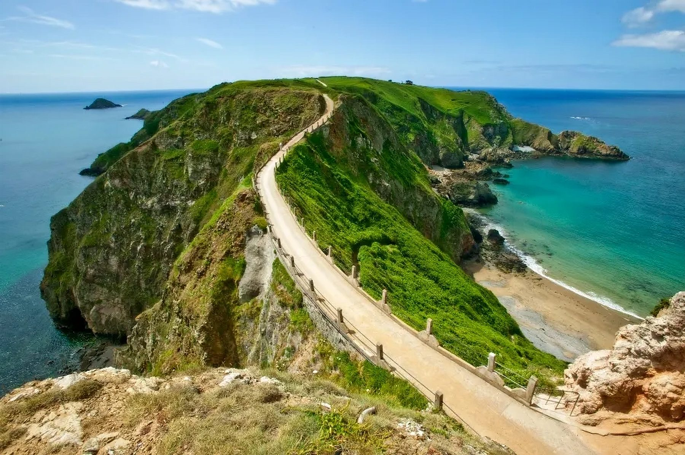
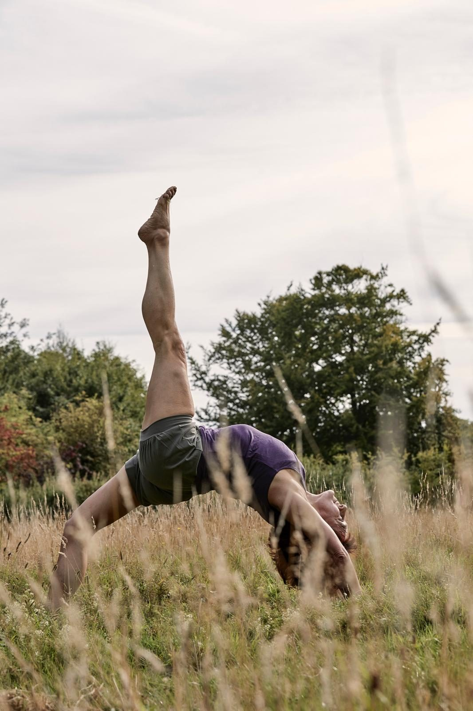
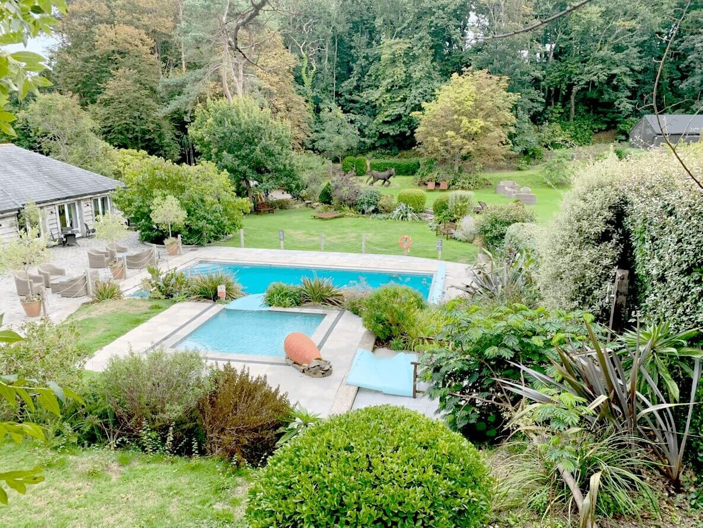
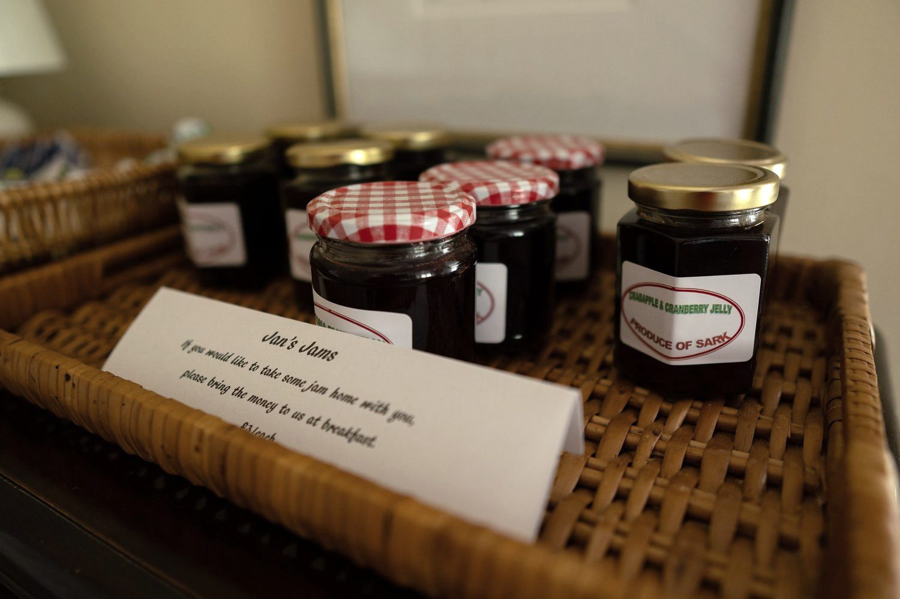

If you are reading this page, you probably do not need burnout explained to you. The exhaustion that sleep does not fix. The feeling of being permanently switched on and completely empty at the same time.

What you need is somewhere the demands actually stop. Not a spa timetable. Not another set of obligations dressed as self-care. Just the conditions in which a tired system can finally stand down.

Sark, we would gently argue, is the best place in Britain to do that.

**Next retreat: 25 to 30 September 2027.** Early booking rate £1,495 shared room.

<a class="btn" href="/retreats-on-sark">Reserve my place</a>

<section class="dark-band on-dark">

After dark

## When the lights never come on, the sky does

With zero light pollution, you will see more stars here than you have ever seen in your life. In 2011 Sark became the world’s first Dark Sky Island, protected by the simplest choice of all: no street lights to dim the night. On clear September evenings the Milky Way arrives without being asked.

</section>

<section class="qa">

The environment

## Why this island, for this problem

Burnout is partly a problem of environment. Modern life keeps the body in low-grade vigilance: traffic, noise, screens, light at all hours, the sense of always being reachable and always behind.

Sark removes those conditions almost entirely, and it does so without you having to try.

There are no cars for visitors, so the background hum most of us have stopped noticing is simply absent. Evenings darken the way your body expects them to, because no street lighting means no light pollution, and sleep tends to follow the way it was always meant to. The island is bounded by sea in every direction, and the horizon becomes a constant, calming anchor. Psychologists call the effect of landscapes like this soft fascination: attention held gently by cliffs, water and birds, asking nothing back, while the overworked, directed part of the mind quietly recovers.

Guests often tell us they feel their shoulders drop within the first day. That is what a genuine nervous system reset feels like from the inside. Not a technique or a protocol, just the moment the body registers that vigilance is no longer required. The island sets the stage, and the retreat does the rest: the practice, the food, the care around you. You just have to arrive.

</section>

<section class="qa rev">

The week

## A week with a light touch

A retreat for exhausted people should not be strenuous, and ours is not.

Mornings begin with gentle yoga and breath work with Monica, taught for all levels and adaptable to however you arrive. Afternoons are unscheduled: walk the cliffs, swim, sleep, read in the farmhouse garden, or genuinely do nothing. Evenings bring a long shared dinner cooked by Bram, and skies dark enough to show the Milky Way.

Nothing is compulsory. Rest is not a gap in the programme here. It is the programme.

> "We felt supported as individuals, not just as part of the group."
>
> A May 2026 guest, from her handwritten reflection

> "The practice was hugely helpful in managing some of the postural issues that I experience. The support from you both was fabulous individually, and to the group as a whole."
>
> Andrea, May 2026

</section>

<section class="qa">

Around the table

## Rest needs company as much as quiet

One of the lonelier parts of burnout is how isolating it is. The retreat is small by design, no more than twelve guests in one historic farmhouse, and something happens around that shared table over five days. People arrive wound tight and guarded, and leave softer, lighter and connected. You are welcome to as much solitude as you need, but the company is there, and it helps more than people expect.

</section>

<section class="qa rev">

Dates & price

## Dates, price and what's included

**25 to 30 September 2027.** Five nights, all meals, daily yoga, guided walks and every activity included. No decisions to make once you are here, which for most of our guests is part of the relief.

Shared room, early booking: **£1,495**, standard rate £1,695. Single room, early booking: £1,995.

</section>

<a class="btn" href="/retreats-on-sark">Reserve my place</a>

