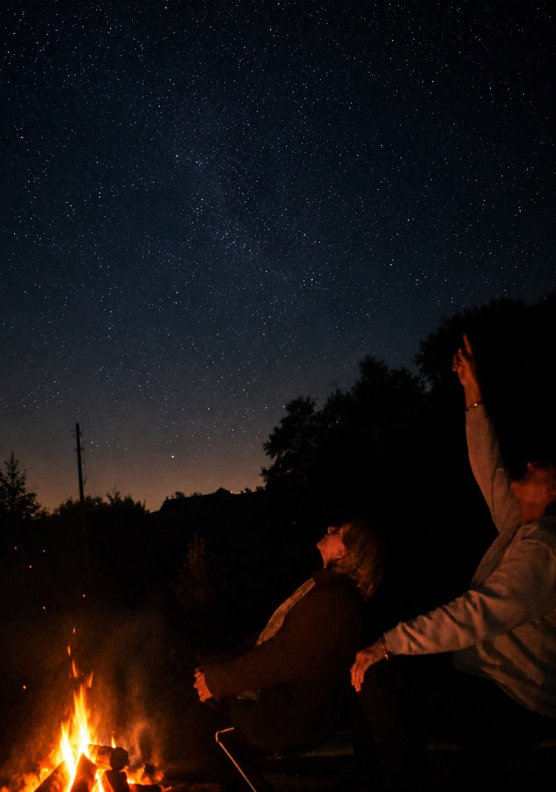
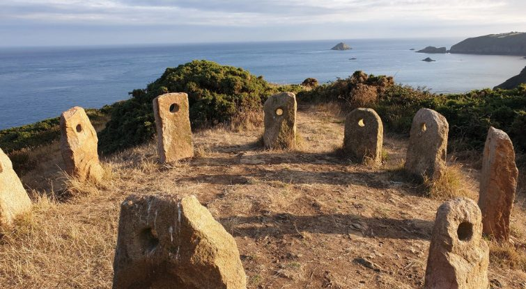
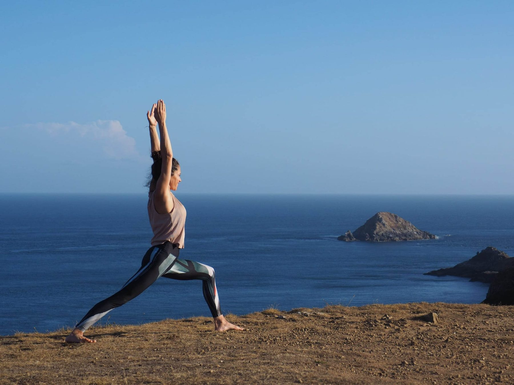
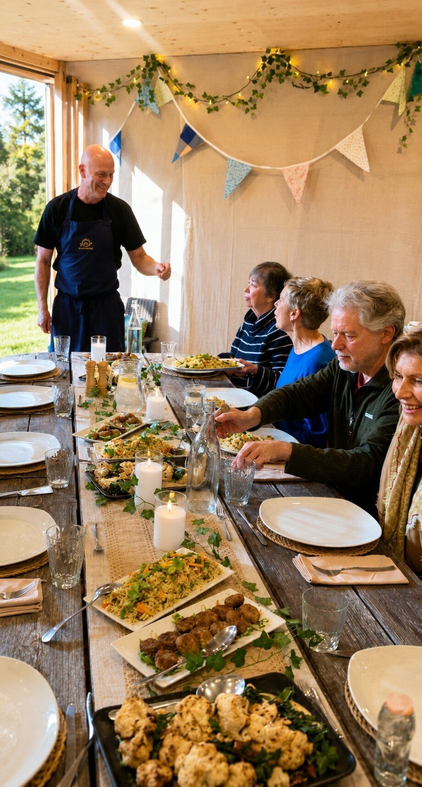

In 2011, Sark became the first island in the world to be designated a Dark Sky Island. It was not an achievement so much as a recognition of what the island had never lost: a night sky with zero light pollution, where the stars are simply out of this world. There is no street lighting here and there are no cars for visitors, so when the sun goes down, the night does not dim. It deepens.

On a clear evening the Milky Way is not a faint smudge but a textured band across the whole sky. Most of our guests have never seen it before. Watching them look up on the first clear night is one of the great pleasures of hosting the retreat.

**Next retreat: 12 to 17 September 2026.** Early booking rate £1,495 shared room until 19 July.

<a class="btn" href="/retreats-on-sark">Reserve my place</a>

<section class="dark-band on-dark">

Since 2011

## The world's first Dark Sky Island

With zero light pollution, September's clear nights put the Milky Way right overhead. In 2011 Sark became the first island in the world to earn Dark Sky status, protected by having no street lights at all.

</section>

<section class="qa">

After dark

## How dark is dark?

Genuinely dark. Locals will tell you stories of losing all sense of direction on lanes they have walked for years, the moment a torch fails. Guests walking back to the farmhouse after dinner carry lanterns, and a simple "evening" to a passing stranger stops being politeness and becomes navigation.

That darkness is why September is such a good month for this retreat. The nights are properly long again, the air is often clear, and the island still holds its late summer warmth.

</section>

<section class="qa rev">

Sleep

## Darkness is a wellness feature

This is the part most stargazing pages miss. A truly dark night is not just beautiful. It is restorative.

Research has shown that ordinary evening room light is enough to suppress melatonin, the hormone that tells the body it is time to sleep. Most of us live inside that disruption permanently. On Sark it simply does not happen. When the sun sets, the island goes dark, the body gets the signal it has been waiting for, and sleep, combined with sea air and days spent walking, arrives the way it was always meant to. Guests are regularly surprised by how deeply they sleep here from the very first night.

It is also why the phone loses its grip so quickly on this island. Our [digital detox retreat](/digital-detox-retreat) page tells that story.

</section>

<section class="qa">

Sark Henge

## Evenings under the sky

Stargazing on the retreat is unhurried and unforced. Some evenings we walk out together after dinner to watch the sky from the lanes or the headlands. Sark even has its own ancient marker for it: a ring of standing stones known as Sark Henge, one of the finest spots on the island to watch the Milky Way rise.

Other evenings, guests simply step into the farmhouse garden and look up. No equipment is needed, though binoculars reward the curious. In skies this dark, your own eyes are enough.

</section>

<section class="qa rev">

The days

## The rest of the retreat

The nights are the headline, but the days earn them. Morning yoga with Monica, taught for all levels. Cliff walks above coves and tidal pools. Bram's vegetarian cooking around one shared table. Free afternoons to swim, read or wander. No more than twelve guests, five nights, one historic farmhouse.

New to the island? Start with [Why Sark?](/why-sark) for the full picture of this extraordinary place.

</section>

<section class="qa">

Dates & price

## Dates, price and what's included

**12 to 17 September 2026.** Five nights, all meals, daily yoga, guided walks and every evening under the darkest skies in the British Isles. Shared room, early booking: **£1,495** until 19 July 2026, then £1,695. Single room, early booking: £1,995.

</section>

<a class="btn" href="/retreats-on-sark">Reserve my place</a>

