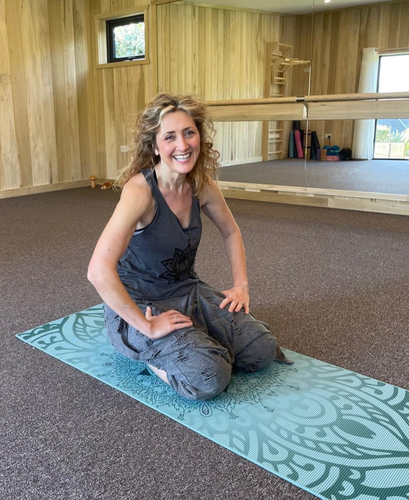
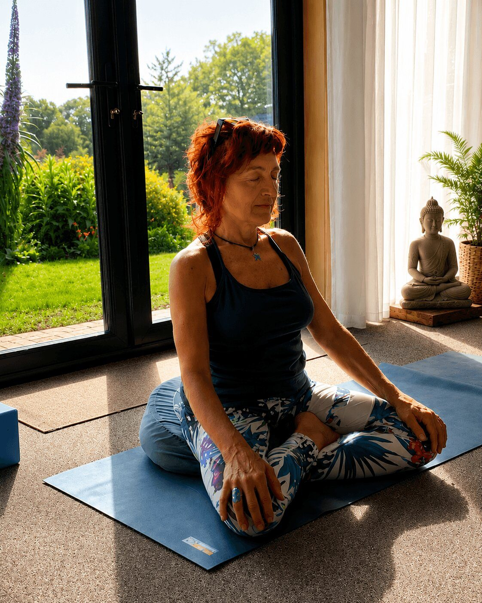
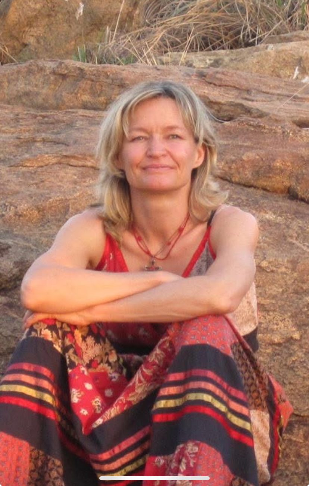
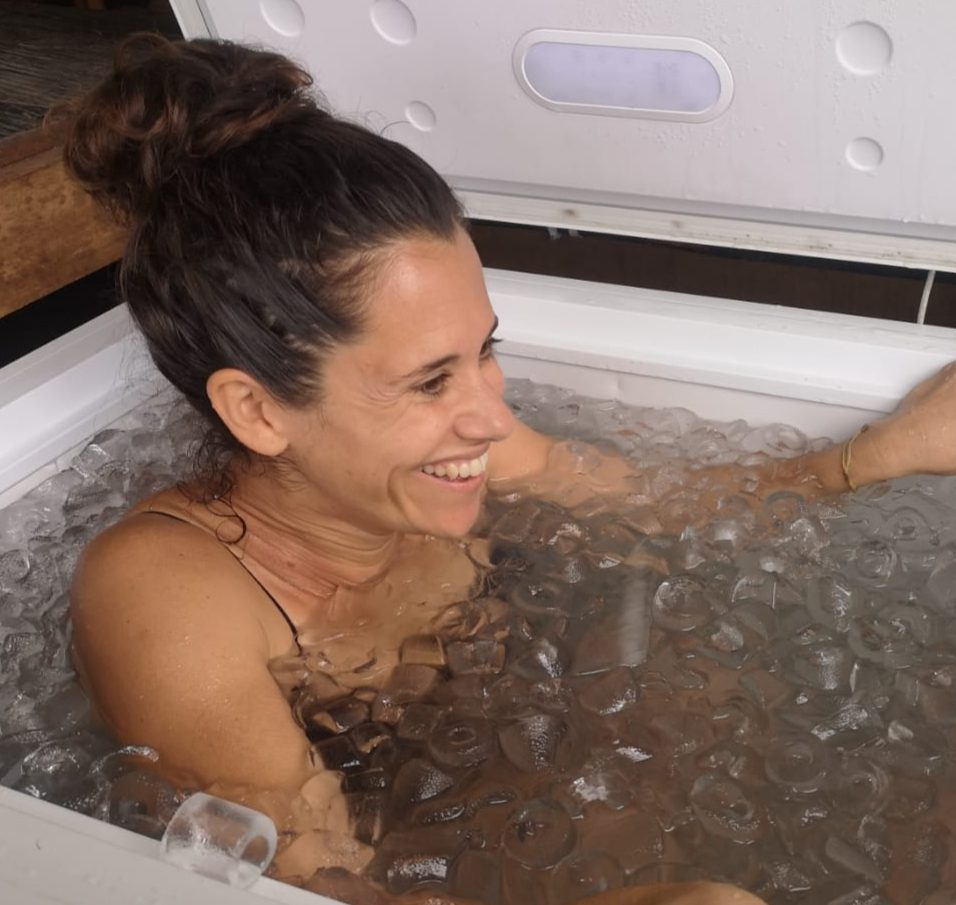
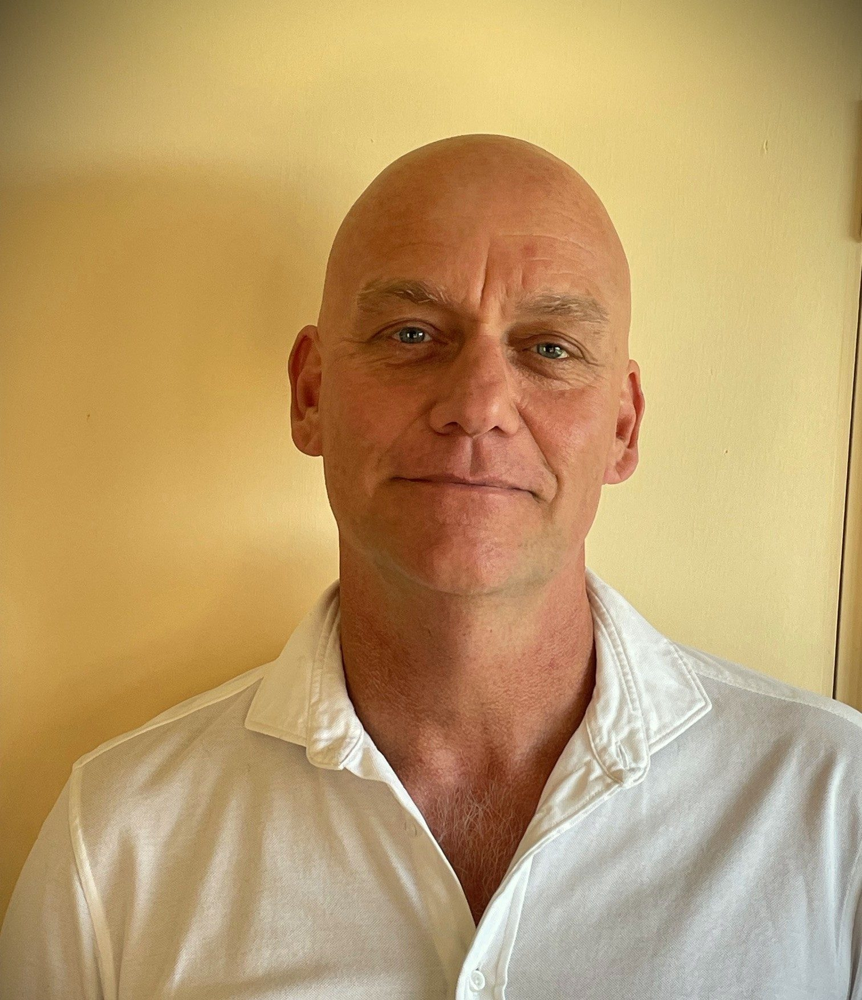
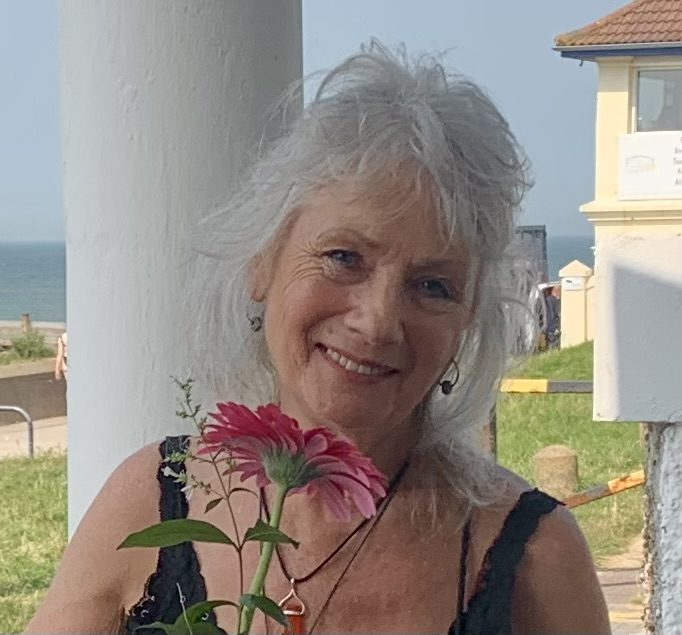
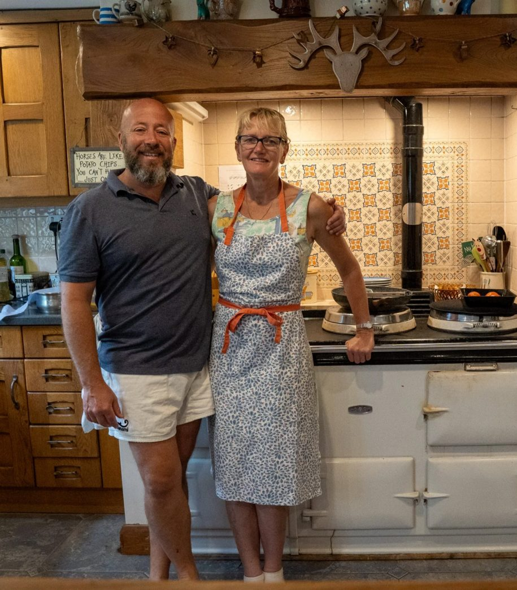

## Nadia

Founder & Host of Sark Soul Island Retreats. Loved for the positive energy she brings.

Nadia has lived and breathed yoga all her life, embracing yoga not only as a daily practice but as a way of life. A qualified massage therapist, she combines her passion for yoga, healing touch, and connection with nature to create truly transformative spaces for others.

Drawn to Sark by its peace, wild beauty, and slower way of living, Nadia found in the island a place that felt like home, with no cars, no light pollution, and a deep sense of stillness. She now shares this magical setting with others through retreats that honour yoga, community, and the healing power of nature.

## Monica

Senior Yoga Teacher. Wisdom facilitator.

Monica is a highly respected yoga teacher, accredited by both the British Wheel of Yoga and Yoga Alliance. With decades of experience, she brings a senior level of teaching that blends strength, grace, and therapeutic depth.

Her classes draw inspiration from Hatha and Tantra traditions, combining asana, pranayama, and meditation to create a practice that is grounding, energising, and deeply nourishing. With a thoughtful and intuitive approach, Monica guides each retreat guest safely through sequences that balance the body and calm the mind, leaving space for true transformation.

## Louise

Reiki Practitioner, Yoga Teacher, Professional Artist.

Louise was attuned as a Reiki practitioner over 16 years ago and has also trained in four levels of Pranic Healing by Master Choa Kok Sui. Sensitive to energy and fascinated by its power as a healing tool, she intuitively combines Reiki and Pranic Healing techniques in her sessions, which restore equilibrium.

Also a professional artist, Louise works with a deep sense of the light and energy of her subjects. She offers Reiki sessions as an optional add-on during the retreat. Based on Sark with her family since 2021, she embodies a lifestyle rooted in art, yoga, and connection to nature.

## Ana

Breath Coach, Cold Immersion, Certified Lifeguard & Yoga Instructor.

Radiating warmth and calm strength, Ana's gentle presence and joyful energy make every experience grounding and uplifting. As well as being a practiced yoga instructor and Breath Coach, Ana also offers guests the opportunity to be guided through ice bath experiences rooted in modern neuroscience and the body's natural ability to heal.

Ana's sessions explore the link between breath, cold, and the nervous system, awakening resilience, balance, and a profound sense of inner calm.

## Bram

Chef Extraordinaire, Director of Laughter and excellent vibes.

Bram is one of our retreat chefs with years of professional kitchen experience and a passion for good, honest food. He focuses on seasonal ingredients, simple flavourful cooking and a deep love of food as nourishment for body and soul.

He co-runs a freelance catering company on Sark with his good friend and fellow chef, Phil. Together they will be preparing fresh nourishing vegetarian meals that are both wholesome and indulgent, to support daily yoga practice, served in a relaxed welcoming atmosphere, making each meal an experience in itself.

## Julienne

Qualified Massage Therapist and Psychotherapist. Wonderful Soul.

Julienne is both a qualified massage therapist and psychotherapist, with decades of experience helping people find healing and balance. Her holistic approach recognises the deep connection between body and mind, that one cannot be healed without the other.

With an open spirit, love of nature, and a genuine warmth for all people, Julienne brings a healing presence that goes far beyond technique. Her sessions are deeply restorative, helping to release tension while supporting emotional and mental wellbeing.

## Helen & Alex

Our retreat home is lovingly run by Helen and Alex, who have lived on Sark for over 25 years. As the owners of this historic guesthouse, they take pride in offering a warm Sark welcome to all who stay.

Helen and Alex provide our daily breakfasts and ensure that everything in the accommodation runs smoothly, so you can simply relax and enjoy the retreat experience. Their knowledge of the island and long connection to Sark make them an integral part of the atmosphere.

## Sark Island

Our most important team member is the island itself.

And all the wonderful souls who call Sark home. We are very grateful to you for sharing this piece of paradise with us all.

Check the [Sark Tourism official site](https://www.sark.co.uk) for more.

Learn about [the practice](/the-practice), read [why Sark](/why-sark), or [see dates and reserve your place](/retreats-on-sark).
