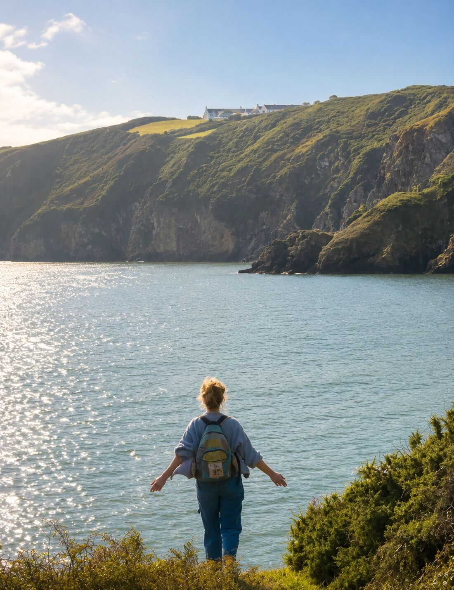

> "From the first time I set foot on Sark, I knew this island held something different..."
>
> Nadia, Founder & Host 🌿

Sark Soul Island Retreats was born from a deep love of yoga, nature, and the rare magic of this car-free island.

Experiencing Sark's timeless beauty, the sound of the sea, the rhythm of horse-drawn carriages, and the starlit skies inspired a vision: to create a space where people could come together, belong, and reconnect with what truly matters.

The retreats weave together daily yoga, nourishing food, and the wonder of Sark's wild landscape, from hidden coves and woodland paths to its world-renowned Dark Sky. Each gathering is about connection: to the island, to each other, and to ourselves.

At its heart, Sark Soul Island Retreats is an invitation to slow down, breathe, and remember our place in the wider world. It is about belonging, shared experience, and the kind of community that lingers long after you have left the island.

[Meet the team](/meet-the-team) who bring each retreat to life, learn about [the practice](/the-practice), or [see dates and reserve your place](/retreats-on-sark).
