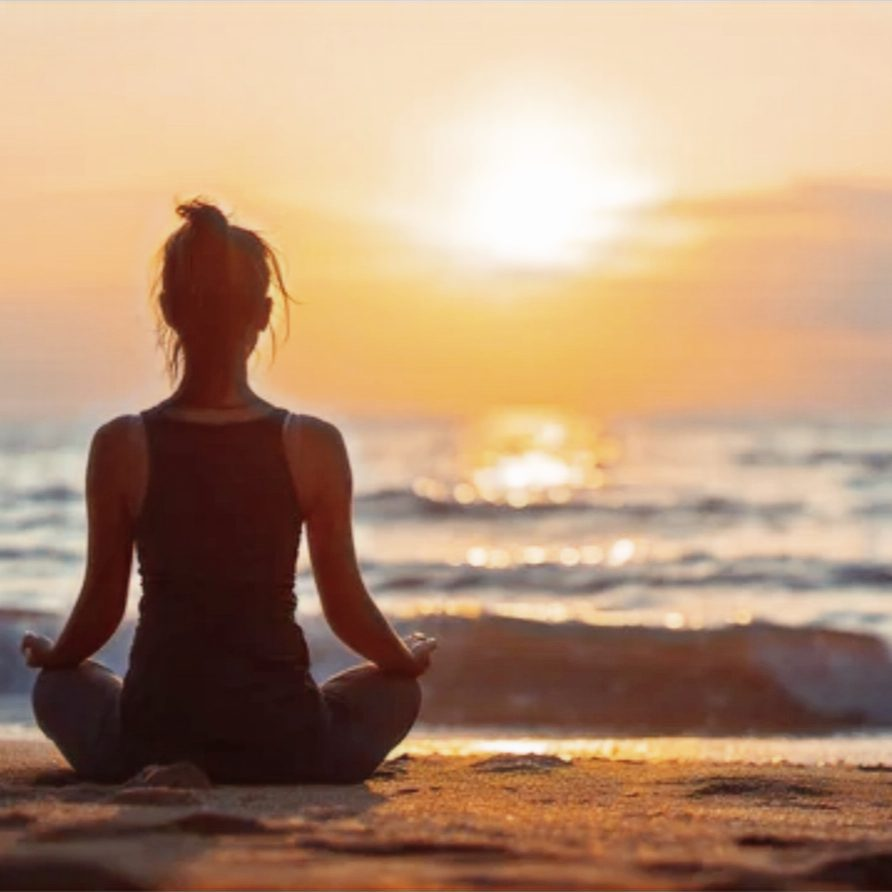

## Yoga & Nature Island Retreat

Small group retreats on Sark, designed for rest, movement and reset.

**Sep 12 to 17, 2026. Early booking rate ends 31 July, [book now](/retreats-on-sark#rooms).**\
May 16 to 21, 2026, sold out.\
September 2027, [now open to book](/retreats-on-sark-2027).\
June 2027, [join the waitlist](/contact).

Every room is en-suite in a beautifully historic farmhouse, surrounded by award-winning gardens and open countryside. Shared or single occupancy.

> "I thoroughly enjoyed all aspects of the retreat. Everything that was organised was brilliantly communicated. The detail of everything from the property, the studio and the menus was meticulous."
>
> Andrea, May 2026

## Retreat & Rooms Investment

<strong>Two rooms remain for September, Wild Thyme and Sea Lavender.</strong> The early booking rate is £1,495 per person sharing, £200 less than the standard £1,695 which returns on 31 July, or £1,995 for single occupancy. A £300 deposit holds your room, returned in full if anything changes that does not suit you or the retreat cannot run. Looking at next year instead? 25 to 30 September 2027 is confirmed and now open, <a href="/retreats-on-sark-2027">choose your 2027 room</a>.

All-inclusive for five nights: accommodation, meals, twice daily yoga, guided walks, a night at the observatory and every activity, fully hosted for less than £300 a night. Choose your room below, each has its own reservation page with secure PayPal or card payment.

Prices are per person, exclusive of flights and transfers. Bookings are first come first served and subject to our <a href="/terms-conditions">Terms &amp; Conditions</a>. The balance is due 45 days before the immersion.

