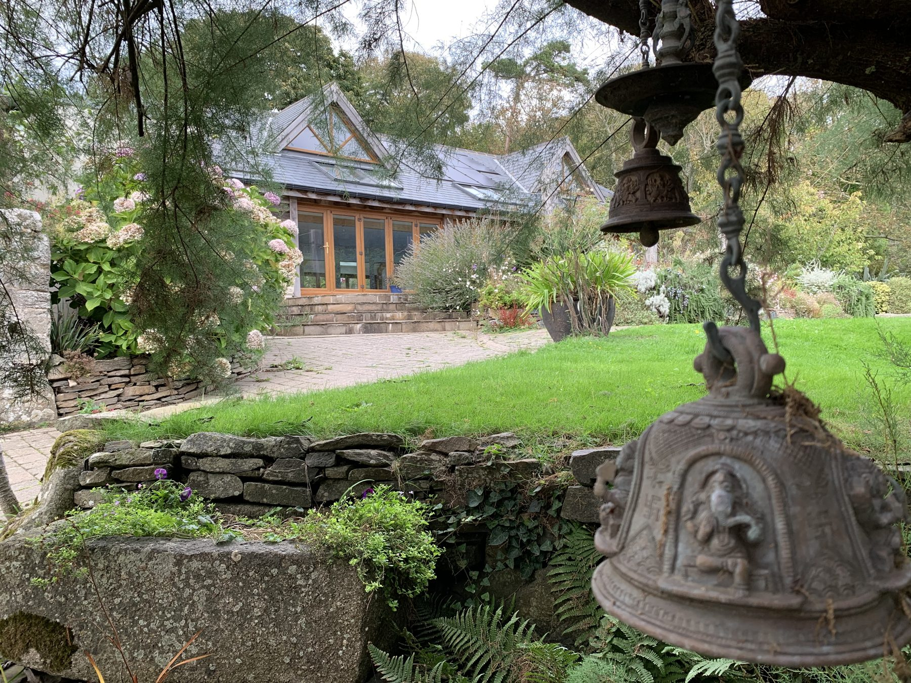
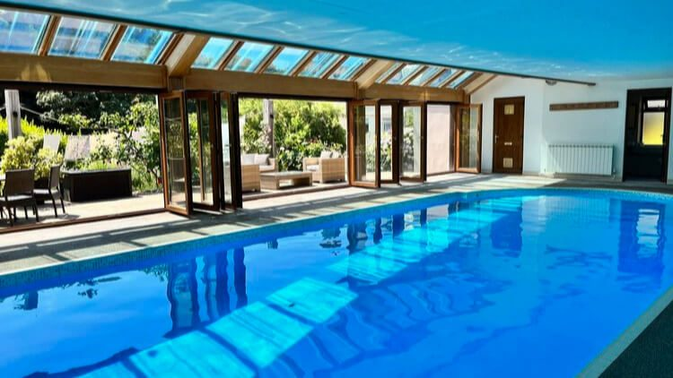
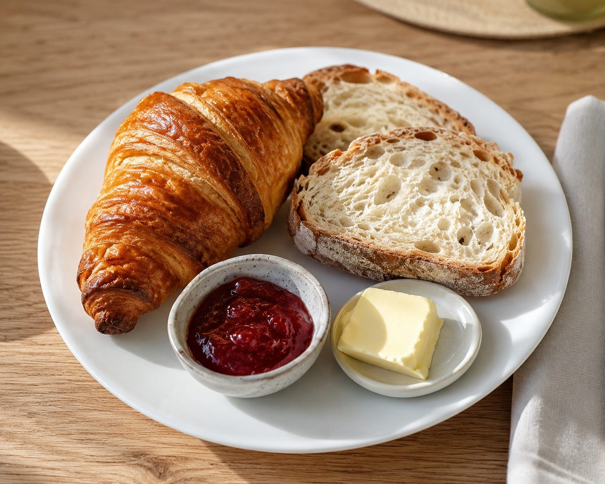

**Late Summer Retreat on the Isle of Sark, 12 to 17 September 2026, with Monica Marini of YogaMorphic.** Early booking rate ends 19 July, limited spaces available. May 2026 sold out. June 2027, [join the waitlist](/sark-island-yoga-retreat-faq).

## Retreat & Rooms Investment

All-inclusive 5-night retreat: accommodation, meals, yoga and activities. Prices are per person, exclusive of flights and transfers. Bookings are on a first come first served basis and are subject to our [Terms & Conditions](/terms-conditions). A £300 deposit per person secures your place; the balance is due 45 days before the immersion.

All rooms are located within our beautifully historic farmhouse surrounded by award-winning gardens and open countryside. Each room is en-suite, simply styled and designed to support rest and ease. Choose between shared or single occupancy depending on your preference.

## The rooms

**'Wild Thyme', double or twin room en suite** (shared £1,495 per person, single £1,995). Elegant and serene, our ensuite rooms offer a soothing space after each day's practice. Every detail has been designed for comfort, so you can breathe, reflect, and simply be.

**'Sea Lavender', double or twin room en suite** (shared £1,495 per person, single £1,995). Spacious and comfortable, this ensuite room is a sanctuary for slowing down. Thoughtfully arranged to support rest and reflection.

**'Coastal Rose', twin room en suite** (shared £1,495 per person). Light filled and restful, this ensuite room blends simple elegance with natural textures. A peaceful space designed for deep rest, quiet mornings and gentle evenings.

**'Sea Holly', twin room en suite** (shared £1,495 per person). Warm and understated, this ensuite room offers a soothing space after each day's practice. Soft tones create an atmosphere of peace, ease and grounding.

**'Honeysuckle', king or twin en suite** (sold out for September 2026). A spacious luxurious en-suite with king or twin beds and beautiful original stonework. Full of the warmth and character of our private historic farmhouse.

**'Foxglove', private ensuite room, single occupancy only** (£1,995). A serene sanctuary designed for one, this charming en-suite room invites deep rest and a restful space. Perfect for those welcoming additional privacy within the rhythm of retreat life.

To book, choose your room and pay the £300 deposit. Each room has its own reservation link below; until the per-rate PayPal payment links are connected, each one opens an email to Nadia with your room already named. One link per room and rate, never a shared payment link across different prices.

<a class="btn" href="mailto:info@sarksoulretreats.com?subject=Booking%20request%3A%20Wild%20Thyme%2C%2012%20to%2017%20September%202026">Reserve Wild Thyme</a>
<a class="btn" href="mailto:info@sarksoulretreats.com?subject=Booking%20request%3A%20Sea%20Lavender%2C%2012%20to%2017%20September%202026">Reserve Sea Lavender</a>
<a class="btn" href="mailto:info@sarksoulretreats.com?subject=Booking%20request%3A%20Coastal%20Rose%2C%2012%20to%2017%20September%202026">Reserve Coastal Rose</a>
<a class="btn" href="mailto:info@sarksoulretreats.com?subject=Booking%20request%3A%20Sea%20Holly%2C%2012%20to%2017%20September%202026">Reserve Sea Holly</a>
<a class="btn" href="mailto:info@sarksoulretreats.com?subject=Booking%20request%3A%20Foxglove%20single%2C%2012%20to%2017%20September%202026">Reserve Foxglove</a>

## What's Included

Yoga, Pranayama and Meditation twice daily. A guided night-sky session at Sark Observatory. Time to rest and relax. Horse-drawn carriage to your accommodation. Five nights luxury farmhouse accommodation. All activities: guided walks, turquoise coves, swimming. Nutritious vegetarian meals from our private chef. Sark ferry coordination. Pools and wellness facilities, plus private yoga studio, gardens and quiet spaces. Dedicated retreat support.

**Retreat add-ons**, available as additional treatments: massage therapy, Reiki, and guided breathwork with cold immersion.

## Your home for the week

Enjoy everything the retreat house has to offer, from relaxing spaces to unique island experiences. Your retreat house is one of Sark's most beautiful historic farmhouses. A small private estate surrounded by gardens, woodland, and birdsong. It's intimate, warm, and deeply peaceful, the perfect setting for a soulful retreat.

Your residence includes:

- Indoor and outdoor pools
- Elegant, peaceful bedrooms
- Sunny terraces for morning tea
- Quiet corners for journaling or solitude
- Beautiful walks right from the door
- A newly created private yoga studio

**Heated pools.** Unwind with a swim in a warm and inviting indoor pool, allowing the water to ease you back into a state of deep relaxation, or experience tranquility in the heated outdoor pool among restful garden spaces.

**Organic homegrown food.** Stroll through the beautiful permaculture gardens, vegetable garden, cedar greenhouse, apple orchard, chicken pen, and bee hives. Fresh, vibrant vegetarian food is prepared by our private chef using organic produce grown in our own garden. We also forage Dulse, wild Sark seaweed, prized for its natural truffle and black pepper notes.

**Award winning landscapes.** Nature and sustainability come together in perfect harmony in award-winning gardens. Discover the variety of plants and flowers that flourish here and the methods used to nurture these beautiful spaces.

**Experience Sark by bike.** Explore the island at your own pace, discover scenic paths, hidden coves and breathtaking views.

**Carriage rides.** Experience Sark's traditional mode of transport with a scenic carriage ride.

## Booking & travel, how it works

Most guests reserve their place first and organise travel with our support. Once your place is held, we will guide you through ferry timing, booking and any questions, so you don't need to have everything figured out before committing. A deposit holds your place, the rest unfolds with guidance.

**Getting to Sark.** Reaching Sark is part of the retreat experience, a jewel reached only by boat. From Guernsey, the crossing with [Sark Shipping](https://sarkshipping.gg) takes around 55 minutes, gently easing you from everyday pace into island life. Please note that the last ferry to Sark departs at 4pm. Full travel guidance will be shared with all confirmed guests, and our [travel guide](/visiting-sark-for-a-wellness-retreat) answers every practical question.

Questions before choosing a room? See the [retreat FAQ](/sark-island-yoga-retreat-faq) or write to Nadia at info@sarksoulretreats.com. Explore the retreats: [yoga](/yoga-retreat-sark), [digital detox](/digital-detox-retreat), [solo for women](/solo-retreat-women), [burnout](/burnout-retreat) and [dark sky](/dark-sky-retreat).
