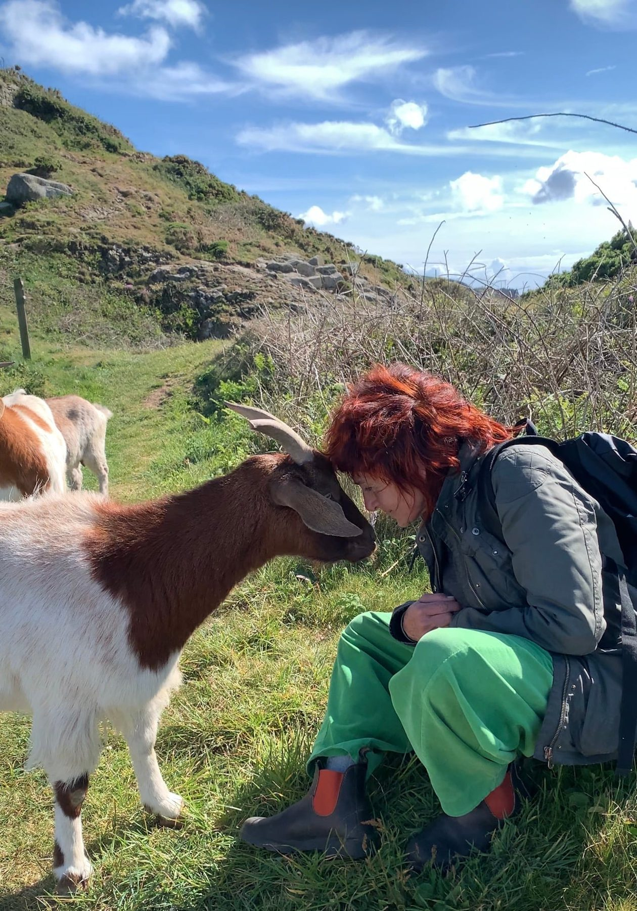
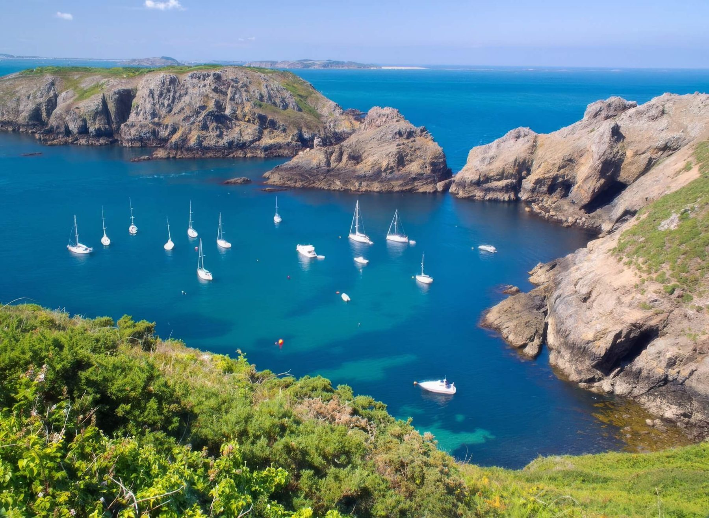
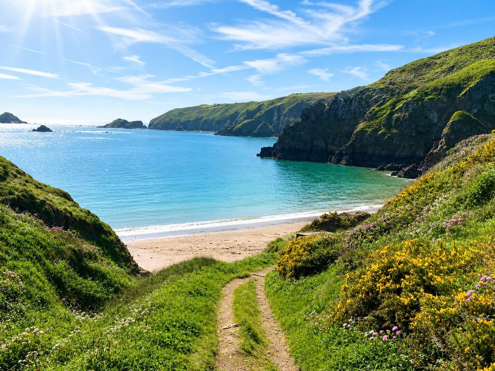

Most of our guests arrive alone. <em>You will not be the only one.</em>

With no more than twelve guests sharing one farmhouse, one table and one morning practice, no one stays a stranger past the first evening.

**Next retreat: 12 to 17 September 2026.** Early booking rate £1,495 shared room until 19 July.

<a class="btn" href="/retreats-on-sark">Reserve my place</a>

<section class="dark-band on-dark">

After dark

## When the lights never come on, the sky does

With zero light pollution, you will see more stars here than you have ever seen in your life. In 2011 Sark became the world’s first Dark Sky Island, protected by the simplest choice of all: no street lights to dim the night. On clear September evenings the Milky Way arrives without being asked.

</section>

<section class="qa">

Easy alone

## Why solo travellers choose Sark

Some places are simply easy to be alone in, and Sark is one of them.

The island is car-free for visitors, so there is no traffic to navigate and nowhere feels hurried. The lanes are quiet, the distances are small and everything on the island is reachable on foot or by bicycle. It is a small community where people greet each other on the paths. On an island with no street lighting, a friendly "evening" on a dark lane is simply how Sark works.

None of this needs dramatising. It is just a very comfortable place to travel on your own, which is exactly why so many women do.

</section>

<section class="qa rev">

Company and solitude

## Alone, but never lonely

The rhythm of the retreat gives you both things people come for: company when you want it, and solitude when you need it.

Mornings begin together with yoga, taught by Monica for every level of experience. Meals are shared around one long table, cooked by Bram, and the conversation takes care of itself. Walks along the cliff paths happen in twos and threes and comfortable silences.

The middle of each day is yours. Swim, read in the garden, find a quiet cove, or do nothing at all. Nothing is compulsory, and needing an afternoon to yourself is understood here, not questioned.

Guests who arrive alone tend to leave with friends they keep. The change in the group between day one and day four is one of the quiet pleasures of hosting these weeks.

</section>

<section class="qa">

The retreat house

## One house, one table

You stay at our historic farmhouse, a real home rather than a hotel, with a much-loved garden and corners to disappear into. Shared rooms make the retreat more affordable and are how many solo guests choose to come. A limited number of single rooms are available if you would rather have your own space.

</section>

<section class="qa rev">

Getting there

## The journey is simple

Fly or sail to Guernsey, then take the passenger ferry to Sark, a crossing of 35 to 55 minutes. From the harbour, a tractor-drawn toast rack carries everyone up the hill and a horse and carriage brings you to the retreat house. Many guests travelling alone find others from the retreat on the same crossing. Our [Getting to Sark guide](/visiting-sark-for-a-wellness-retreat) covers every practical detail, and we help you plan the journey when you book.

</section>

<section class="qa">

Dates & price

## Dates, price and what's included

**12 to 17 September 2026.** Five nights, all meals, daily yoga, guided walks and every activity included. Shared room, early booking: **£1,495** until 19 July 2026, then £1,695. Single room, early booking: £1,995.

</section>

<a class="btn" href="/retreats-on-sark">Reserve my place</a>

