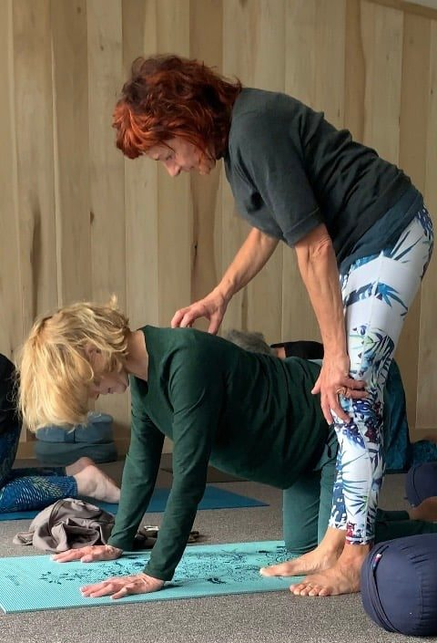

## Your Instructor for the week

Each day opens and closes with yoga. Morning practice to wake the body gently, evening practice to let the day settle. Monica Marini leads every session, drawing on around thirty years of teaching. Her style is warm and unhurried, with room for both seasoned practitioners and those returning to the mat after time away.

You will never be pushed to perform. Sessions are small by design, so the teaching meets you where you are. Through years of study with international teachers and her own dedicated practice, Monica has learned to make space for creativity, integration, and the quiet joy of inner freedom. Between practices, the days are yours: coastal walks, sea swims, quiet corners for rest. The rhythm is simple, and that simplicity is the point.

## This immersion is for you, if:

- You may be sensing that something new wants to take shape
- You are willing to question and open to slowing down
- You are comfortable with nature, simplicity, and shared space
- You feel ready to give yourself time without distraction

Places are intentionally limited to preserve intimacy and quality.

Sark Soul Island Retreats was founded and is hosted by Nadia, who leads every retreat alongside Monica. The week is unhurried by design: space to rest, breathe, and come back to yourself, away from the pull of everyday life.

## The Immersion

The intention behind each immersion is to: integrate presence, connection, and deep restoration; tend to our nervous system; fall in rhythm with the subtle pulse of life, our body, and our breath; immerse ourselves in the landscape of the island; align with the land and the elements; share in beauty, peace, warmth and community; restore intimacy with the creative source of our being, and uphold the growth of our adult conscious self.

Inhale is the movement of expansion, when consciousness becomes activated by the desire (kama) for creativity. Exhale is the integration, the absorption of the experience back into the vibratory field of potential (consciousness).

At their core, each immersion holds the same essential intention. Both are complete, whole experiences in themselves, rooted in presence, connection, restoration, and conscious growth. What distinguishes them is not the depth of the practice, but the dynamics through which the experience unfolds.

Each immersion moves between expansion and integration, the inhale that opens and the exhale that absorbs. We arrive, and we digest. The practice meets you in a way that is honest to the moment, the land, and the body's natural intelligence.

## Our Focus

By virtue of being humans, we are compelled to seek understanding about our existence in the world. The teachings of the Radiance Sutras, a tender dialogue between Shiva (consciousness) and Shakti (creation), and their intimate conversation reflects the sensual play of Spanda, the rhythm of expansion and contraction that underlies all existence.

The most tangible, direct expression of consciousness taking form in us is the experience of the breath. In our breath is the very language of life itself. In the breath we are whole and connected. The body is the landscape of this experience. During our immersions we will uncover ancient somatic wisdom through movement, breath practice (Pranayama), and presence. Tapping the primal awareness that manifests through the breath, we will let the body lead, moment by moment, into the wholeness of our being.

We will also take inspiration from the four Dharmas, our soul's desires known as purushartha. They are the ultimate goals of human life, and in order to thrive we need to live from all four.

If you seek to experience life unfiltered, if you wish to practice anew, if you love to feel deeply, join us for an exploration of these living threads of wisdom that bring awareness to our interaction with the creative powers that make us who we are.

## Monica, lead yoga teacher

Inquisitive, restless, permanently seeking and still learning not to take myself too seriously! After more than 30 years of Yoga, my practice has evolved to reflect new learnings and understanding. I've come to know that Yoga is experiential rather than performative and I take a multi-disciplinary approach to the practice, exploring traditional principles and combining them with my interests in science, quantum physics, buddhism, astrology, and functional anatomy.

For me the practice ultimately serves as a refinement of our perception of reality. It points to the transience of this physical being we call 'I', and reveals the magic, subtle power of the 'Self'.

[Meet the whole team](/meet-the-team), read [why Sark](/why-sark), or [see dates and reserve your place](/retreats-on-sark).
