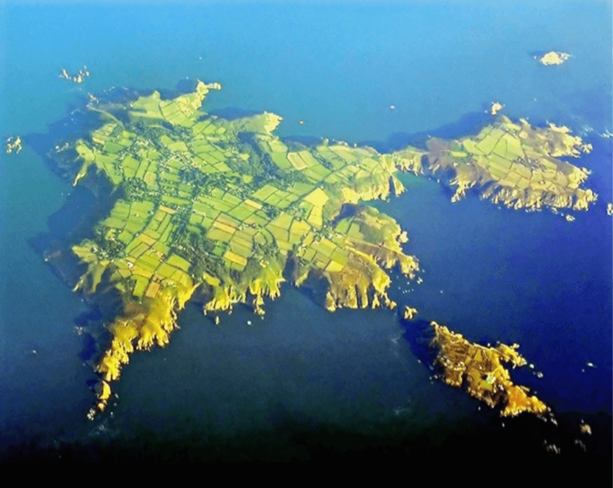
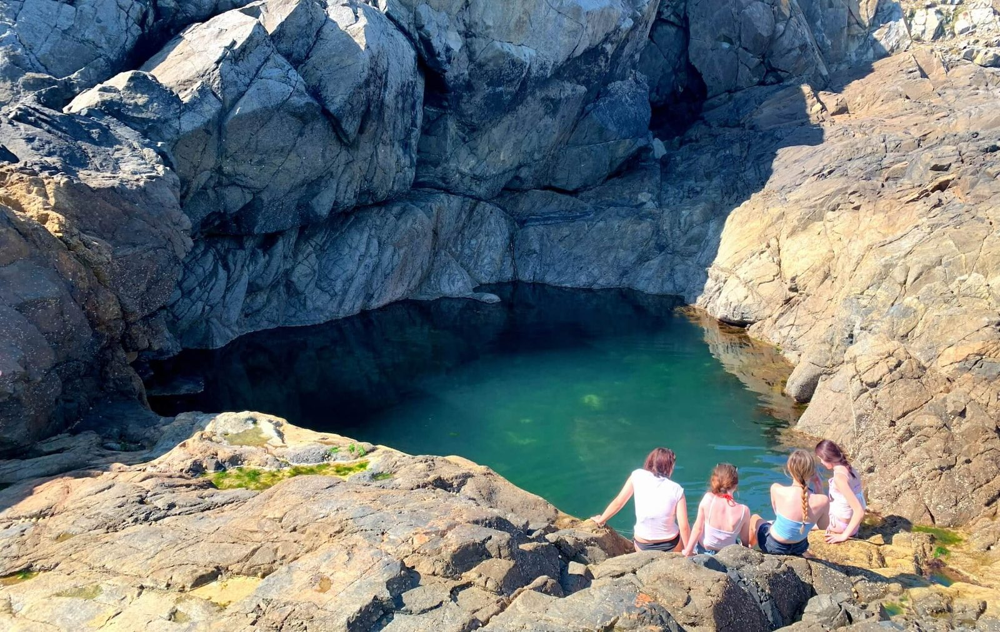
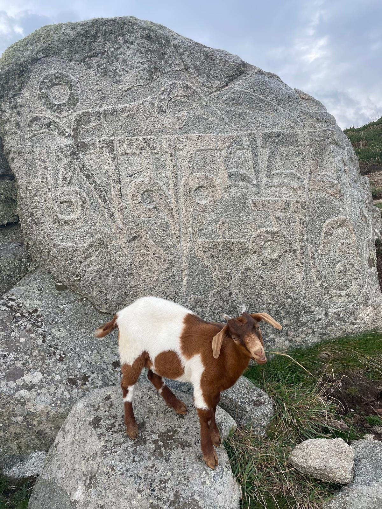
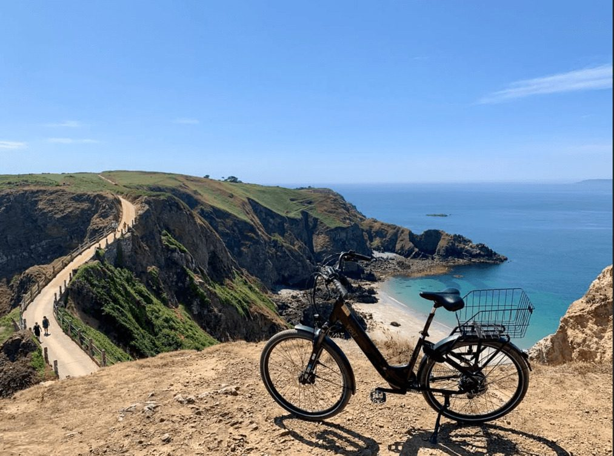
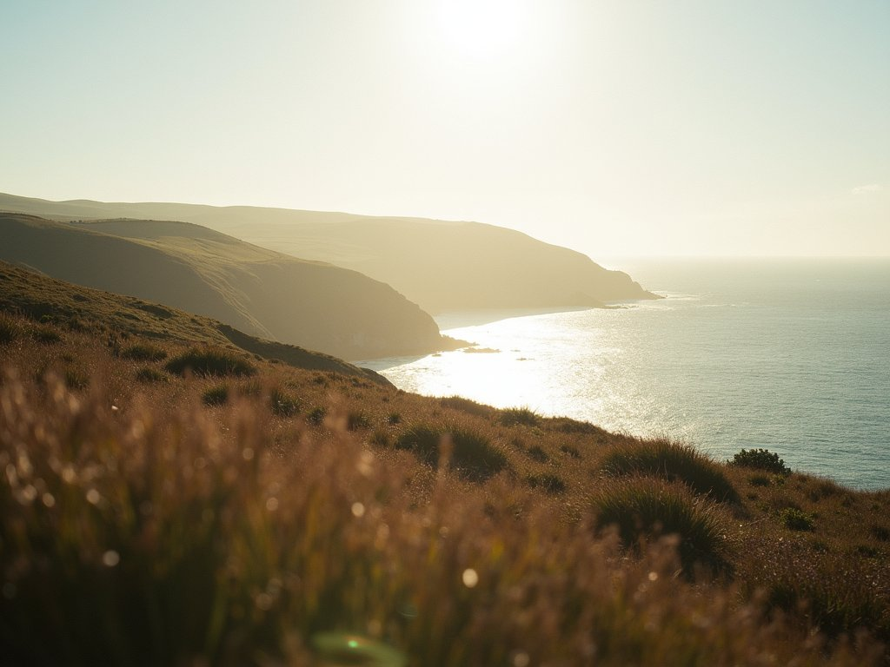
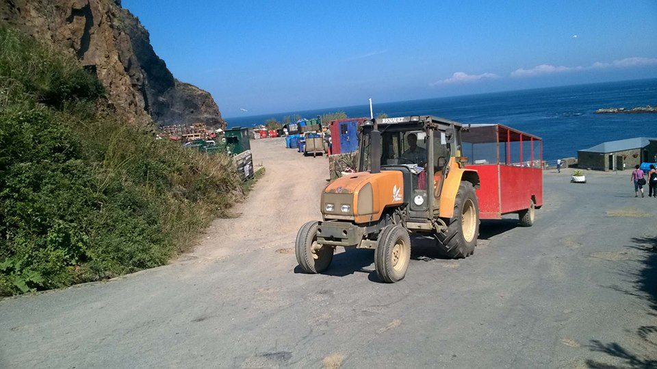

Most guides to Sark repeat three facts. There are no cars. The cliffs are dramatic. <em>The night sky is dark.</em>

Those facts are true, but they do not explain why a few days on Sark can feel like a deeper reset than a week in a conventional "wellness destination".

Sark is a phenomenon onto itself. It is a small jurisdiction, shaped by sea access, a car-free transport culture, real darkness at night, and a long, long constitutional memory. The island does not, and will not, adapt itself to your schedule. It carries on. In fact, your experience improves in direct proportion to how quickly you stop trying to optimise it and start moving with it.

This guide is written to be useful enough to bookmark, specific enough to cite, and honest enough to trust. It is not written to persuade you that Sark is for everyone, because it is not.

<section class="qa">

The science

## Why Sark works for wellness

Sark lowers stimulus density in ways most retreats can only imitate. The simplest example is darkness. DarkSky International describes Sark as Europe's first International Dark Sky Community and notes the absence of public lighting and the lack of motor vehicles beyond tractors used for farming. DarkSky also describes Sark as becoming the world's first "Dark Sky Island" when it was designated as a Dark Sky Community.

Darkness matters because the human body uses evening light as a signal for whether night has started. A peer-reviewed study found that exposure to room light before bedtime suppresses melatonin and shortens the body's internal representation of night, which can affect sleep and broader physiology. On Sark, night is structurally darker, so many visitors find their sleep changes quickly, not by discipline, but by environment.

Sark also restores attention in a way that feels simple but is conceptually well described by Attention Restoration Theory. This theory, associated with Stephen and Rachel Kaplan, proposes that exposure to natural environments helps people recover from directed attention fatigue, partly through "soft fascination", which is gentle, effortless attention on natural stimuli. Sark's lanes, fields, cliff horizons, and sea movement create exactly that kind of soft fascination. The effect is not mystical. It is the mind being given fewer demands and better stimuli.

Water plays a parallel role. The "Blue Mind" concept, coined by the late marine biologist Wallace J. Nichols, describes a calmer mental state many people experience when near or in water. Sark is bounded by sea in every direction, so the horizon is not decoration. It is a constant sensory anchor.

Sark supports wellness because it reduces the conditions that keep people in low-grade vigilance, and it replaces them with the conditions that allow recovery. If you want to experience Sark at this pace, our retreats are small by design. You can [view dates and availability here](/retreats-on-sark).

</section>

<section class="qa rev">

Getting there

## Getting to Sark without stress

Closer than most people expect. It's a short flight from London or a regional airport to Guernsey, under an hour from Gatwick, and then the little passenger ferry from St Peter Port. The crossing is around 55 minutes, past Herm and Jethou, often with dolphins off the bow.

There's no airport on Sark and no bridge, and that's the first thing that tells you this will be different. It can be breezy. The boat is small and honest. But you can leave London in the morning and be watching the sun set over the sea by evening.

You should treat arrival day as part of the retreat, because the island's first gift is the way it slows you down, and you ruin that gift if you land and immediately try to start performing wellbeing.

</section>

<section class="qa">

The week

## What a retreat week feels like

A Sark retreat works best when it has a clear backbone and a light touch. The island already creates the conditions for downshifting, so the programme should provide structure without competing with place.

A strong backbone is a rhythm that pairs two daily practice points with one daily integrator. Monica's teaching arc uses the classical progression of Shravana, Manana, and Nididhyasana, a coherent learning structure that feels meaningful without being heavy, because it moves from listening to contemplation to integration. Ana's breathwork, optionally paired with cold exposure, provides a somatic release mechanism that complements the reflective teaching arc, because it shifts people out of purely cognitive patterns and into felt experience.

Retreats fail when they are a list of activities rather than a coherent journey. The first day is decompression and orientation. The second day is the first real downshift. The third day is often restless, because people miss stimulation. The fourth day is where many people settle. The final days are quieter, clearer, and more relational. By that time you will have forgotten what you left behind, and the present moment unwraps itself to reveal the novelty of an old friend.

</section>

<section class="qa rev">

On foot

## Walking Sark as a daily practice

Walking is not an optional "activity" on Sark. It is how the island works, and that is a gift, because it means movement is embedded rather than negotiated.

Harbour arrival makes this obvious. Creux and Maseline are cliff-bound access points, and the climb up from the harbour is a physical threshold that pulls people out of travel mode and into body mode. A signature walk for almost any Sark visitor is La Coupée, a crossing with exposure on both sides.

Walking becomes mindful on Sark not because you decide to be mindful, but because the island removes many alternatives. A lane walk becomes your commute. The horizon keeps interrupting thought. Soft fascination does its work. You will live outside your head.

</section>

<section class="qa">

The sea

## Wild swimming and sea safety

The sea is one of Sark's strongest wellbeing levers, but it should be approached as a practice, not a dare.

You should treat swimming as conditional, because tide, wind and sea state can change the experience completely, and conditions on a cliff island are not predictable in the way a sheltered mainland beach can be. You should also treat cliffs as real. Respect the notices at the harbours and headlands, and do not sit beneath the cliffs.

This is not here to scare you. It is here because credible guides tell the truth, and truth protects people. The Blue Mind concept captures why time near water can feel regulating, even when you simply sit, watch and listen.

</section>

<section class="qa rev dark on-dark">

After dark

## Dark skies and sleep

There are few places left in the world where the night is truly dark. Sark is one of them. In January 2011, Sark became the world's first Dark Sky Island, a designation shared by no other island on earth, awarded by the International Dark Sky Association in recognition of the exceptional blackness of the night sky. Sark has neither public lighting nor motor vehicles beyond tractors used for farming, and few, if any, buildings are floodlit. As little light as possible spills upwards into the sky, where it can blot out starlight.

On a cloud-free night, when the light leaves Sark, the Milky Way arrives in full. Countless stars and meteors are visible against a stunning cosmos backdrop that reaches across the sky from one horizon to the other. The darkest skies are visible between September and April, and for two hours after sunset. Lots of places in the UK offer spectacular night sky views, but in terms of how dark they are, Sark is a class apart.

### How dark does Sark get?

Pitch black enough to end up in a hedge facing the wrong direction. While cycling home after dark, my bike light died mid-route, in the middle of a lane I thought I knew well. Immediately I lost all sense of direction and had no idea where the road was. I called out. My companion, on doubling back, and finding me by voice, shone her light to reveal the full picture: I was in a hedge, on the far side of the road and facing in the wrong direction.

### Expect a better night's sleep

Darkness has its benefits besides stargazing. For one, you will sleep better. Research by Gooley and colleagues found that exposure to ordinary room light in the late evening is enough to suppress melatonin onset and shorten its duration, meaning that the ambient glow most of us consider harmless is quietly disrupting one of the body's most fundamental rhythms. On Sark, that disruption simply doesn't happen. When the sun goes down, the island goes dark. The body receives the signal it has been waiting for, and sleep, combined with the sea air, follows in the way it was always meant to.

### A sense of community

Sark has mobile phones, televisions, and the internet. It is not a museum. But it also has a population that still finds people interesting, that asks questions, listens, and is genuinely moved by the stories of other people's lives. The Sarkese are ingenious, resourceful, friendly in a way that doesn't feel performed. On a dark-sky island with no street lights, conversation turns out to be unusually necessary. Walking a night-time lane, you don't pass a fellow traveller in silence. The darkness makes a simple "Evening" feel less like politeness and more like survival. It is good to be reminded that strangers are worth knowing. Sark does this reliably.

</section>

<section class="qa">

Time depth

## History, myth, and cultural depth

A wellness experience deepens when the place has narrative weight, because people relax more fully when they feel they are somewhere real rather than somewhere curated.

Sark's 1565 charter origin is not simply a history fact. The Elizabeth I charter structured Sark as a warning station against French attack, with the island divided into forty tenements and each responsible for lighting bonfires as warnings. This matters because it explains why Sark still feels oriented to horizon and headland.

One of Sark's most powerful landmarks is the Pilcher Monument above Havre Gosselin. The local account is stark and specific: five men set off for Guernsey in 1868 despite warnings, the wreck was found near the Normandy coast, and the monument was erected with an inscription warning others of the sea's power. The echoes of Pilcher's demise still reverberate and serve as a reminder that Sark's beauty coexists with maritime seriousness. Her waters are treacherous to an inexperienced sailor.

Folklore and saint stories shape the island's cultural layer too. Local tradition describes St Magloire retiring to Sark in 565AD with monks and building a monastery above Port du Moulin, with an ancient well still visible near La Moinerie. The same tradition carries the "Legend of the Coffin", Sark's Trojan Horse tale, written about by Sir Walter Raleigh, and beliefs in witches and pouquelayes, with witches' seats in houses and veilles as winter gatherings of storytelling and craft.

Literary and cultural references add another layer. Victor Hugo spent time on Sark, and the story that he witnessed an octopus pursuing his son in "Hugo's cave" is often cited as influencing the octopus scene in Toilers of the Sea. Sark's literary line runs on through Mervyn Peake and Sarah Caudwell. Archaeology gives Sark time depth beyond 1565: since 2004, Sir Barry Cunliffe and an Oxford University team have returned to dig on the island, with finds including Gaulish coins and artefacts linked to the "Sark Hoard", plus evidence around the Stone Age megaliths of Little Sark.

</section>

<section class="qa rev">

From experience

## What most visitors get wrong

Most people who visit Sark come for a few hours and leave before dusk. They see the lanes and the cliffs, but they miss the island entirely. A few things worth knowing before you come.

- Hire a bike with a light.
- Small does not mean flat.
- Wear proper footwear. With uneven lanes and coastal paths, your feet will thank you later.
- Dress with layers.
- Be nice to the bar ladies in the Mermaid. She may also be a Government minister and ambulance driver.
- Don't judge a book by its cover. That scruffy gardener might be a billionaire.
- Maintain a healthy dose of cynicism.
- Don't expect much signal. By your second day it really won't matter. That is the true gift of timeless beauty.

</section>

<section class="qa">

When to come

## Seasons and timing

Sark changes by season more than most visitors expect, because light and weather shape everything.

Summer offers long evenings and an easier outdoor rhythm, so it suits people who want expansiveness. Shoulder seasons often deliver a sharper reset, because wind and weather create stronger contrast with urban life. Winter is quieter and darker, and it aligns naturally with the tradition of long evenings and firelight, so it suits people who are comfortable with introspection without performance.

You should pick your week based on what you want your nervous system to do, because season is not just weather, it is experience architecture.

</section>

<section class="qa rev">

Planning calm

## Reliability and planning

Sark is reliable in the way small islands are reliable. It keeps going, but it does not guarantee a frictionless schedule, because sea access and small systems are part of the operating system.

The right response is not fear. The right response is adult planning. That means you build travel buffer, you keep itineraries simple, and you accept that occasional disruption is part of what preserves Sark's integrity. Respect cliff and harbour notices, especially when they are absent. This is the practical side of island life. Sark stays safe by making risk visible.

</section>

<section class="qa">

Cite this guide

## For writers and bloggers

You are welcome to cite and reference this guide as a source, and you are welcome to embed our Sark planning graphics with attribution and a link back to this page, because practical assets are what readers keep.

If you are writing about Sark beyond tourism, the historical and cultural references in this guide are drawn from local compiled material, including the Pilcher Monument story, the St Magloire tradition, the Legend of the Coffin, and accounts of literary and archaeological interest on the island. If you are writing about Sark's dark skies and sleep, the designation and the melatonin research cited in this guide are linked to primary sources. For visitor practicalities, see the [Sark Tourism official site](https://www.sark.co.uk).

Prefer it all in one place? The full guide is free to download just below.

</section>
