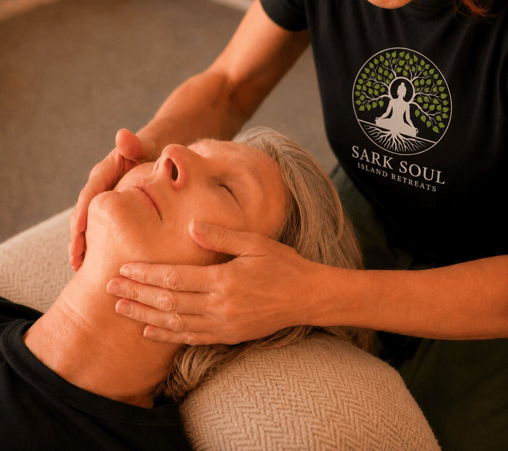
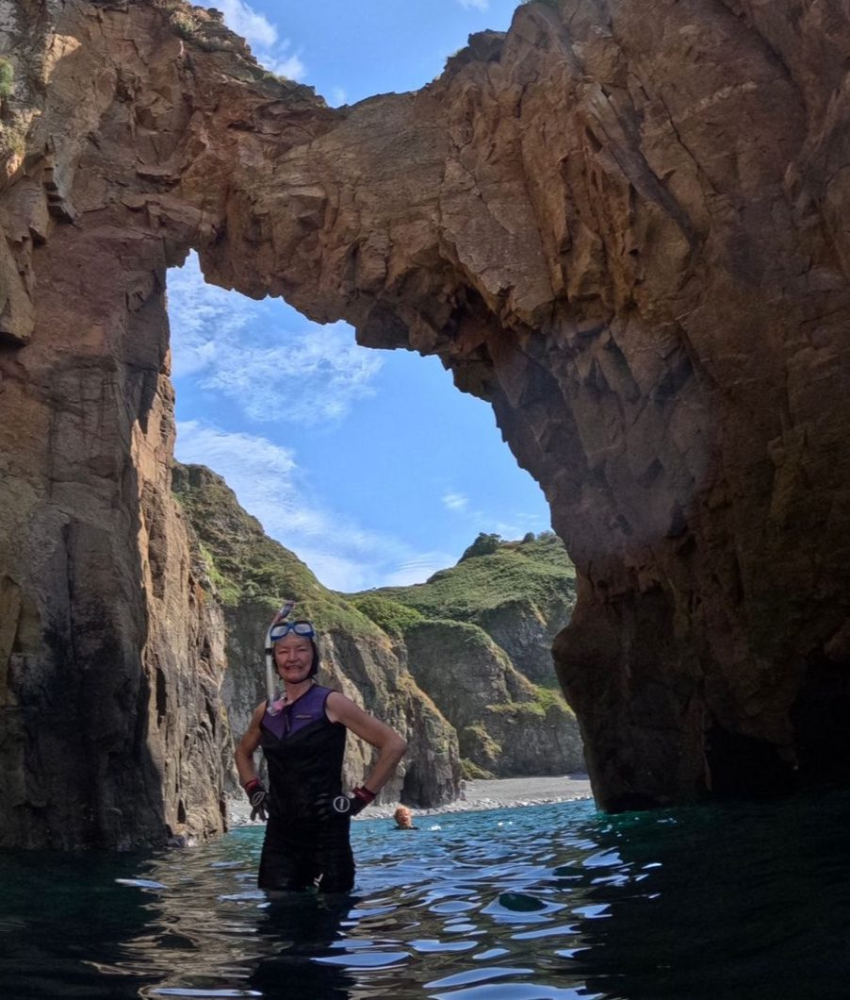

Most guides to Sark repeat three facts. There are no cars. The cliffs are dramatic. <em>The night sky is dark.</em>

These things are true, but they do not begin to explain what makes Sark special, or why a few days here resets you deeper than a week at a conventional destination.

This guide is written first-hand, by the people who live it. Each section is short on purpose, and where there is a longer story to tell, it links to the full piece in [The Sark Journal](/journal).

Jump to: <a href="#why-sark-works-for-wellness">Why Sark works for wellness</a> · <a href="#getting-to-sark-without-stress">Getting to Sark without stress</a> · <a href="#what-a-retreat-week-feels-like">What a retreat week feels like</a> · <a href="#walking-sark-as-a-daily-practice">Walking as a daily practice</a> · <a href="#wild-swimming-and-sea-safety">Wild swimming and sea safety</a> · <a href="#dark-skies-and-sleep">Dark skies and sleep</a> · <a href="#history-and-cultural-depth">History and cultural depth</a> · <a href="#what-most-visitors-get-wrong">What most visitors get wrong</a> · <a href="#seasons-and-timing">Seasons and timing</a> · <a href="#reliability-and-planning-calm">Reliability and planning calm</a> · <a href="#optional-upgrades">Optional upgrades</a> · <a href="#planning-tools-and-next-steps">Planning tools and next steps</a> · <a href="#for-writers-and-bloggers">For writers and bloggers</a>

<section class="qa">

The island

## Why Sark works for wellness

Sark is the island for anyone who is tired. Not tired in the way a good night's sleep fixes, but the deeper kind, the worn-down, out-of-sorts feeling you carry home from too many months of too much. There is no better cure for it than a lazy day on the bracken slopes with the sea murmuring somewhere far below and wildflowers in every direction.

The science quietly agrees. Real darkness at night lets melatonin do its work, the sea gives the mind what researchers call soft fascination, and a car-free island switches off the low-grade vigilance a town never lets you drop. But nobody comes here for the studies.

Read [why we chose Sark](/why-sark), or Nadia's own answer in [Coming to Sark](/journal/coming-to-sark).

</section>

<section class="qa rev">

Getting there

## Getting to Sark without stress

Getting to Sark takes effort. There is no airport. With the exception of royalty and seabirds, every single person who has ever come to Sark has come by sea.

The practical version: fly to Guernsey, about an hour from the UK and Europe, then the little [passenger ferry](https://sarkshipping.gg) from St Peter Port, about 45 minutes across the water. Leave a generous margin at the harbour rather than sprinting for the quay; the boat connects with flights but won't wait for them, and arriving unhurried is half the point. For the airport to harbour leg, a pre-booked car with [Taxi2Where](https://www.taxi2where.com) tracks your flight and takes the stress out of the connection.

The full story, the first sight of the island from the water and the climb ashore, is in [The crossing](/journal/the-crossing).

</section>

<section class="qa">

The week

## What a retreat week feels like

The island does the slowing down; the retreat gives the week a gentle backbone. Twice daily yoga with Monica, morning practice to wake the body, evening practice to let the day settle. Ana's breathwork and cold immersion for those who want them. One house, one table, never more than twelve guests.

Honestly, day by day: the first day is decompression. The second is the first real downshift. The third is often restless, because people miss stimulation. The fourth is where most people settle. The final days are quieter, clearer and more relational, and by then you will have forgotten what you left behind.

See [this year's dates and what's included](/retreats-on-sark), and how [the practice](/the-practice) shapes each day.

</section>

<section class="qa rev">

On foot

## Walking Sark as a daily practice

Walking is not an optional activity on Sark. It is how the island works, and that is a gift, because movement is built into the day rather than negotiated with it.

It starts at the harbour: Creux and Maseline sit at the foot of the cliffs, and the climb up is the threshold that pulls you out of travel mode and into your body. The signature walk is La Coupée, the narrow crossing to Little Sark with the sea far below on both sides. After that, a lane walk becomes your commute, the horizon keeps interrupting thought, and you live outside your head for a while.

Forty miles of coastline wrapped around an island four miles long, and it never runs out of secrets, even for those of us who think we know it.

</section>

<section class="qa">

The sea

## Wild swimming and sea safety

There's swimming for everyone: shallow water you can wade into off the rocks, the deep clear plunge a few feet beyond it for those who want it. There are caves and pools and headlands to clamber over, and there is the simple, slightly addictive pleasure of finding a spot on the coast you've never seen before.

Treat it as a practice, not a dare. Tide, wind and sea state change everything on a cliff island, so swim to conditions, respect the notices at the harbours and headlands, and do not sit beneath the cliffs. On the retreat, swims are guided and chosen for the day's conditions.

Much of the finest coast, the great sea caves and hidden coves, can only be reached from the water. A round-island trip with [Sark Boat Trips](https://www.sarkboattrips.com) is the gentle way to see it.

</section>

<section class="qa rev dark on-dark">

After dark

## Dark skies and sleep

Sark was the world's first Dark Sky Island, named in 2011. With no street lighting, the nights are genuinely black, and the stars are the kind most people have never seen: the Milky Way edge to edge, the lights of half a dozen lighthouses ranged across the sea.

### How dark does Sark get?

Pitch black enough to end up in a hedge facing the wrong direction. While cycling home after dark, my bike light died mid-route, in the middle of a lane I thought I knew well. Immediately I lost all sense of direction and had no idea where the road was. I called out. My companion, on doubling back, and finding me by voice, shone her light to reveal the full picture: I was in a hedge, on the far side of the road and facing in the wrong direction.

### Expect a better night's sleep

Darkness has its benefits besides stargazing. Research by Gooley and colleagues found that ordinary room light in the late evening is enough to suppress melatonin, meaning the ambient glow most of us consider harmless quietly disrupts one of the body's most fundamental rhythms. On Sark that disruption simply doesn't happen. When the sun goes down, the island goes dark, the body gets the signal it has been waiting for, and sleep, combined with the sea air, follows the way it was always meant to.

One evening of every retreat is spent at the Sark Observatory. More on [the dark sky retreat](/dark-sky-retreat).

</section>

<section class="qa">

Time depth

## History and cultural depth

A place relaxes you more fully when it is somewhere real rather than somewhere curated, and Sark has an improbably long memory for somewhere barely four miles long. Saint Magloire's monks in the sixth century, pirates, four hundred French soldiers, and the forty families Helier de Carteret brought in 1565, whose names are still on the island today.

The layers keep going: the Pilcher Monument above Havre Gosselin and its warning about the sea, Victor Hugo and the octopus cave that fed Toilers of the Sea, Mervyn Peake, and Sir Barry Cunliffe's Oxford digs tracing people here back to the Stone Age.

The whole story is in [A very short history of Sark](/journal/a-very-short-history-of-sark).

</section>

<section class="qa rev">

From experience

## What most visitors get wrong

Most people give Sark an afternoon. They walk a lane, photograph the cliffs, and catch the last boat back having missed the island entirely. A few things worth knowing before you come.

- Hire a bike with a light.
- Small does not mean flat.
- Wear proper footwear. With uneven lanes and coastal paths, your feet will thank you later.
- Dress with layers.
- Be nice to the bar ladies in the Mermaid. She may also be a Government minister and ambulance driver.
- Don't judge a book by its cover. That scruffy gardener might be a billionaire.
- There is wifi and phone signal. By your second day you will simply reach for your phone less, and that is the true gift of the place.

The full argument, with the harbour, the carters and the coast by boat, is in [Why a day isn't enough](/journal/why-a-day-isnt-enough).

</section>

<section class="qa">

When to come

## Seasons and timing

In summer the flowers are almost showing off. In autumn the ferns turn gold and the hills go gold and purple in the evening light, and you find yourself just standing there, looking, the way you did as a child before anyone taught you to be busy.

Summer suits people who want long evenings and expansiveness. The shoulder seasons often deliver the sharper reset, because the contrast with home is stronger. Our Late Summer Retreat sits in the sweet spot: warm sea, golden light, and skies at their best in the hours after sunset. This year it runs 12 to 17 September 2026.

</section>

<section class="qa rev">

Planning calm

## Reliability and planning calm

Sark is reliable the way small islands are reliable. It keeps going, but sea access means the occasional change of plan, and that is part of what protects the place. Build a small buffer into your travel, keep the itinerary simple, and respect the cliff and harbour notices.

None of the old ways are enforced on you. Sark has wifi, there is phone signal, the modern world is entirely available here. The island simply has a way of reordering what matters. And it is safe in the old sense: a small, close community, quiet lanes, and no cars for visitors.

On a retreat, all of this planning becomes ours. We send an arrival note with which sailing to aim for, and from the moment you step off the boat, the logistics are handled.

</section>

<section class="qa">

Extras

## Optional upgrades

The retreat is all inclusive: yoga, meals, guided walks, wild swims and the observatory night. A small menu of extras can be added during the week, at additional cost, booked at the house. Massage is the guest favourite, and there is Reiki, cold immersion with Ana, and private yoga sessions with Monica.

The full list is on the [booking page](/retreats-on-sark).

</section>

<section class="qa rev">

Next steps

## Planning tools and next steps

Prefer it all in one place? The full guide is free to download just below, and it travels well: sailing times to check, what to pack, and the questions to ask before you book anywhere, including with us.

When you are ready, the September dates, rooms and rates are on one page: [Reserve my place](/retreats-on-sark).

</section>

<section class="qa">

Cite this guide

## For writers and bloggers

You are welcome to cite this guide, and to use our photography of the island with attribution and a link back to this page. The historical material here draws on local sources, including the Pilcher Monument account, the St Magloire tradition and the Cunliffe excavations, and the sleep science is linked to its primary research. For visitor practicalities, see the [Sark Tourism official site](https://www.sark.co.uk).

If you are writing about Sark and want photography, fact-checking or a first-hand quote, write to us at info@sarksoulretreats.com.

</section>
