
Most people who come to Sark have never been before, and arrive with the same handful of questions. <em>So here are the honest answers,</em> from the people who live on the island.

<section class="qa">

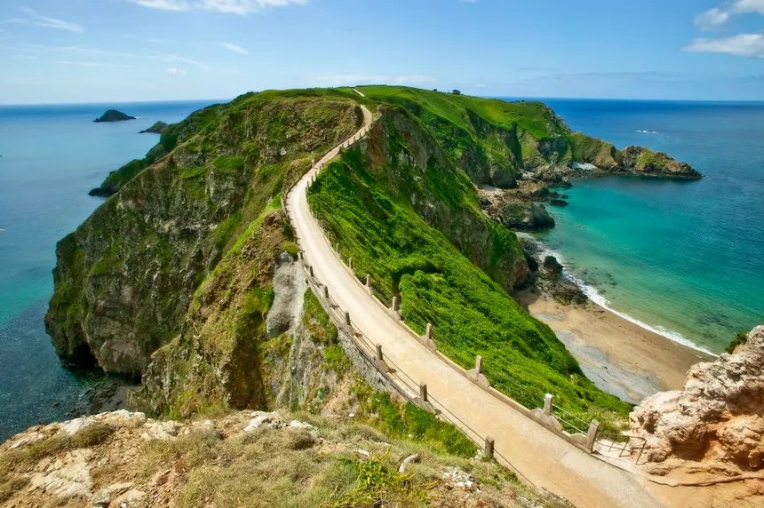

A human pace

## The Magic of Sark

Perhaps the most treasured part of Sark is the sense of belonging it gives. Life here unfolds slowly. Islanders are gardeners, chefs, farmers and craftspeople, each sustaining a culture that's all but vanished elsewhere. That slower rhythm is the thing guests feel first, and miss most when they leave.

Every retreat is a chance to find your tribe: people who share your love of yoga, nature, and discovery. Gathered around the table for a shared meal, walking the cliffs together, or gazing up at the night sky, guests often speak of feeling part of something bigger.

We are constantly inspired by the generations who have called Sark home before us. Their traditions and way of life remind us of the importance of caring for the land and sea. Our hope is to share the magic of Sark with the wider world in a way that respects this heritage, treads lightly, and supports the local community.

</section>

<section class="qa rev">

Sea air

## Why yoga works here.

With no cars and no traffic, every breath feels lighter. Surrounded by sea air, nourished by local food and held by the island's stillness, the practice deepens almost on its own.

</section>

<section class="qa">

Solo travel

## Can I come on my own?

Most of our guests do. With only ten to twelve people in one house, no-one stays a stranger past the first evening. You'll share the table, the walks, the morning practice, and people who arrived alone tend to leave with friends they keep.

You don't need to bring anyone. You just need to come. Our [solo retreat page](/solo-retreat-women) says more.

</section>

<section class="qa rev">

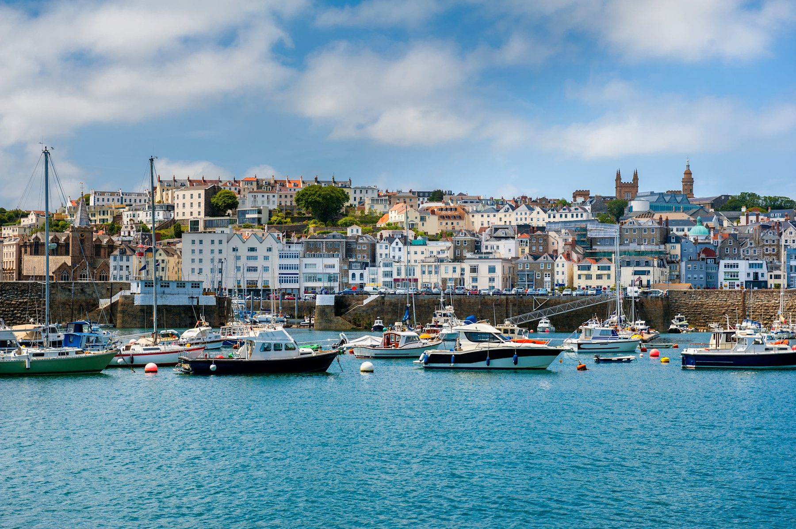

Getting there

## How do you get to Sark?

Sark is closer than most people expect. It's a short flight from London or a regional airport to Guernsey, under an hour from Gatwick, and then the pleasant passenger ferry from St Peter Port with [Sark Shipping](https://sarkshipping.gg). We help guests choose flights that connect comfortably with the Sark ferry and advise them on timings.

When guests arrive in Guernsey, they often have time to explore St Peter Port before the ferry leaves. It's a lovely way to begin the retreat. They can wander around the harbour, explore the cobbled streets, have lunch and start slowing down before heading to Sark.

</section>

<section class="qa">

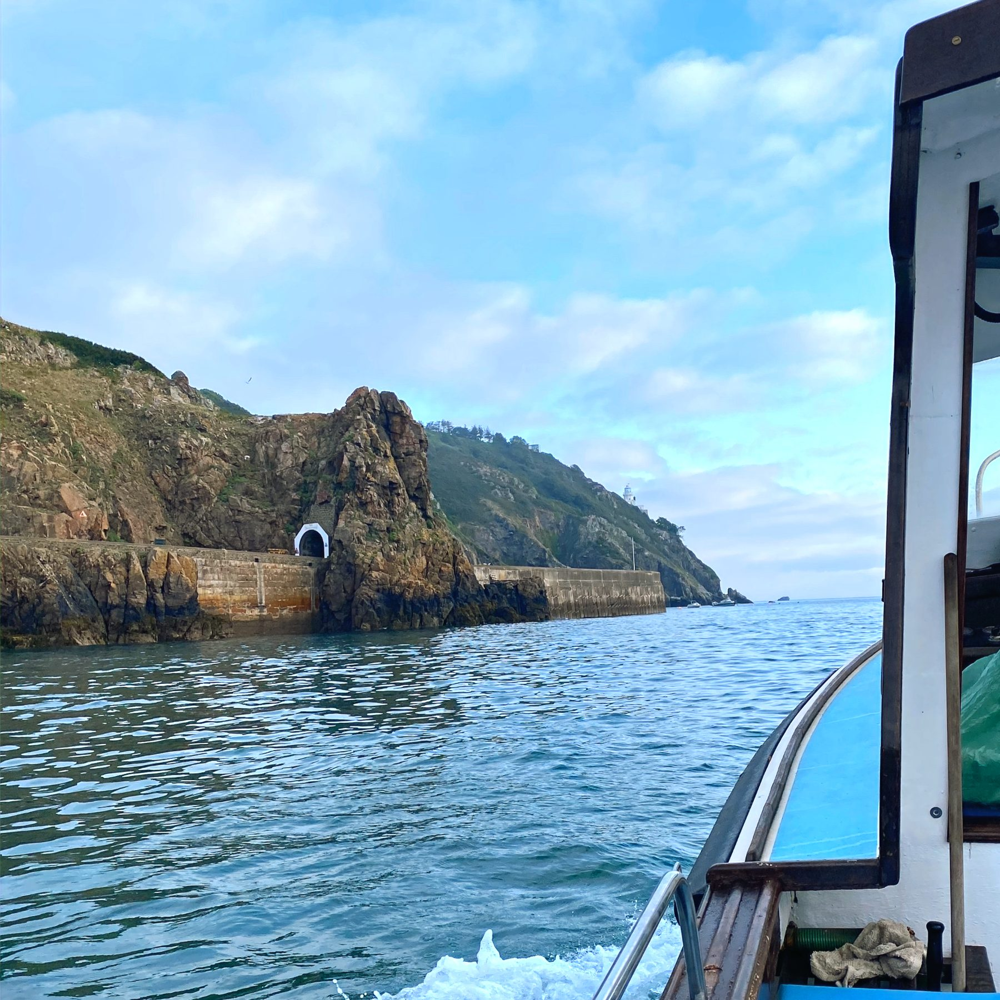

Arriving

## What is the boat journey like?

Most travel websites will tell you which plane, ferry or bus to take, but they don't tell you what it actually feels like. There's no airport on Sark, so the only way to get to it is by boat. The ferry crossing is about fifty minutes, past the Islands of Herm and Jethou. On our last retreat, guests spotted dolphins off the bow.

The ferry crossing is where the retreat really begins. As the boat pulls away from Guernsey, people start to visibly relax and you can see the shoulders dropping. The further away the mainland gets, the lighter everything feels. There is a sense of leaving the busy world behind. As Sark comes into view, excitement starts to build. Guests see the lighthouse, the cliffs and the beautiful turquoise water around the island.

</section>

<section class="qa rev">

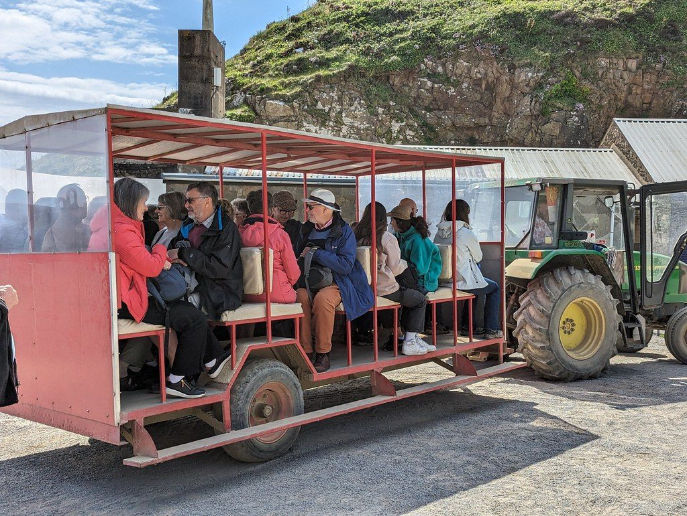

Taking the toast rack

## What happens when you step off the boat?

You walk through a tunnel cut into the rock where guests are met by our team and then taken up Harbour Hill on the famous Sark 'Toast Rack', the tractor-pulled trailer that meets every ferry. The toast rack gets its name because everyone sits in rows facing each other, rather like slices of bread in a toaster.

For many people this is their first truly memorable Sark moment. It's bumpy, fun and usually involves a lot of laughter. I can remember being told "Hold on to your boobs, it's a bumpy ride."

</section>

<section class="qa">

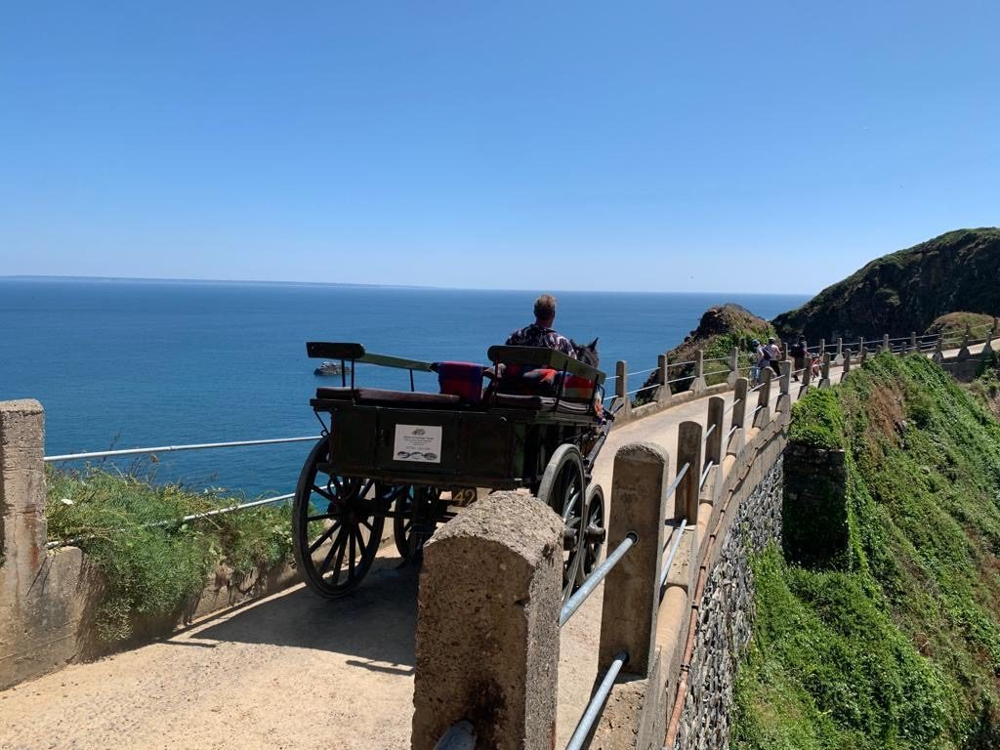

Your chariot awaits

## Do people use Horse and Carriages on Sark?

At the top of the hill, guests transfer to a beautiful horse and carriage. The carriage ride is your first proper introduction to the island. You begin learning about Sark while taking in the scenery and atmosphere.

By the time you arrive at the accommodation, something has already shifted. You've left airports behind. You've left traffic behind. You've left deadlines and daily routines behind. You've crossed the sea, seen dolphins, travelled by toast rack and horse and carriage, and arrived somewhere that feels completely different from modern life. No wonder the retreat begins long before the first yoga session.

</section>

<section class="qa rev dark on-dark">

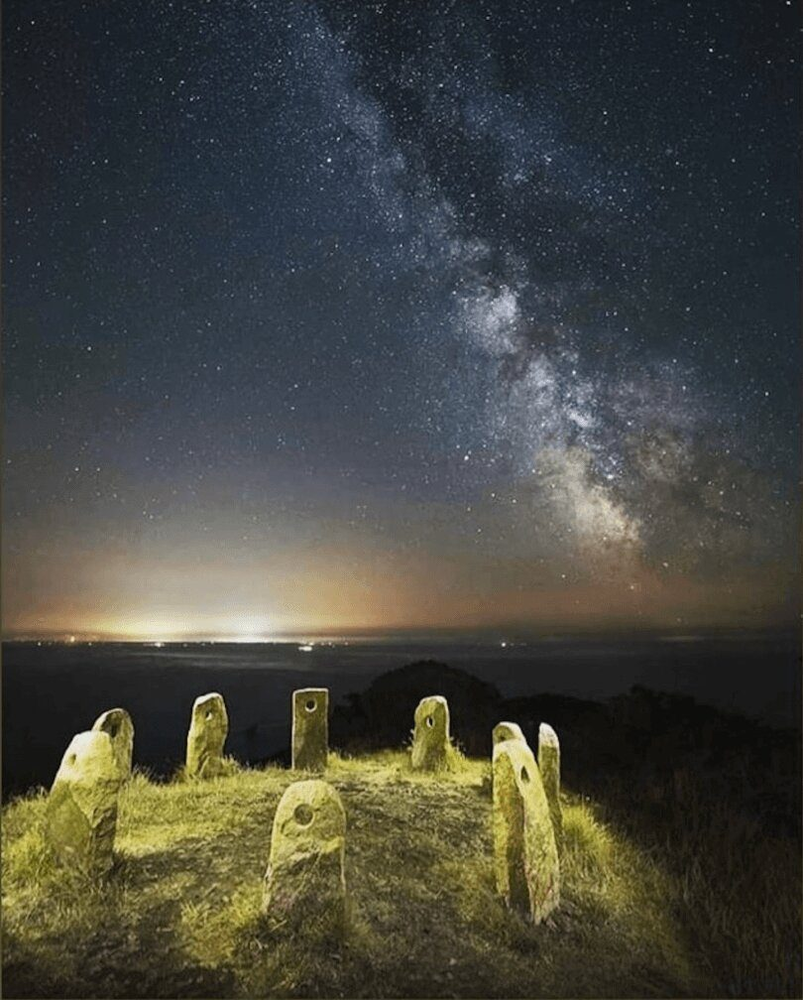

Dark Sky Island

## Is it really that dark at night?

When night falls on Sark, the sky transforms into a breathtaking theatre of stars. Recognised as the world's first Dark Sky Island, Sark offers unparalleled stargazing. With no streetlights and no cars, the night deepens. Beneath the Milky Way, connection deepens, with the cosmos, with nature, and with one another.

There's signal here, and there's wifi. You simply stop reaching for your phone, because there's something better to look at. Our [Dark Sky retreat](/dark-sky-retreat) is built around exactly this.

</section>

<section class="qa">

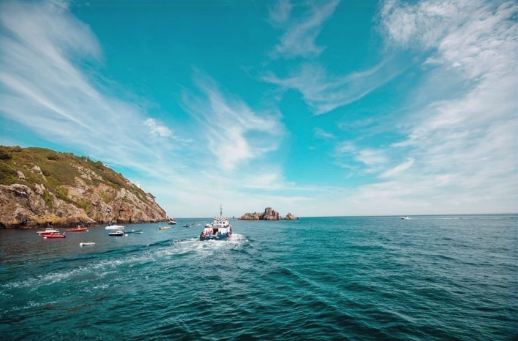

Arriving

## Planning for your visit

Sark operates its own unique luggage system. Guests can collect their ferry tickets and luggage labels from Sark Shipping, leave their luggage in the holding area and enjoy Guernsey without dragging suitcases around. Their luggage is then transferred for them and delivered directly to the accommodation in Sark.

</section>

<section class="qa rev">

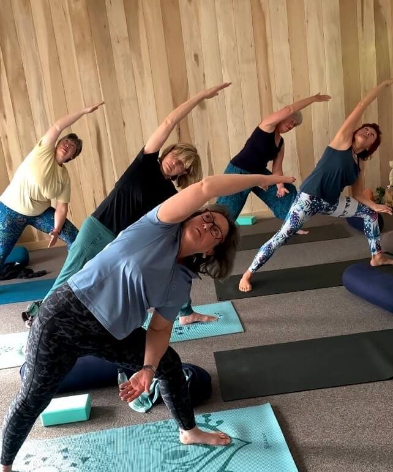

The practice

## Do I need to be good at Yoga?

Our sessions suit every level. Monica, who has taught for thirty years, meets you where you are. Come as you are; the practice adapts to you. Mornings wake the body gently, evenings let the day settle, and the island sets the pace in between. Most guests leave feeling lighter, steadier, more themselves. Read more about [the practice](/the-practice) or our [yoga retreat on Sark](/yoga-retreat-sark).

</section>

<section class="qa">

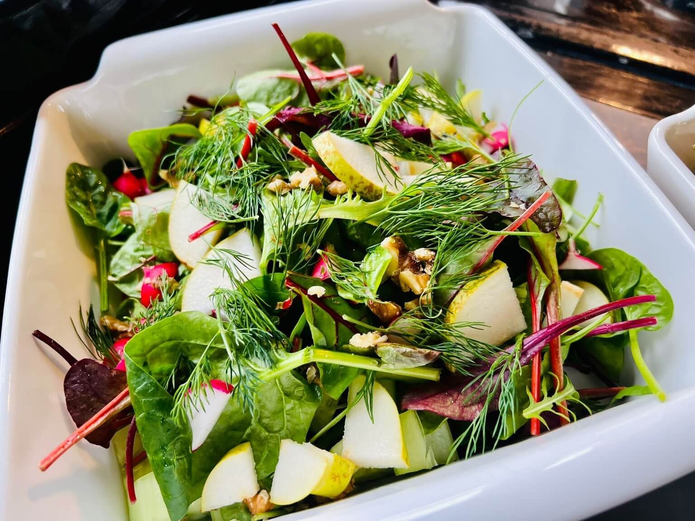

The food

## What's the food like?

Our Chefs, Bram and Pip, cook vegetarian, generous and seasonal, from what the island offers. Everyone eats together, family-style, around one long table. Meals are unhurried and there is always enough. Dietary needs are looked after; just tell us in advance.

</section>

<section class="qa rev">

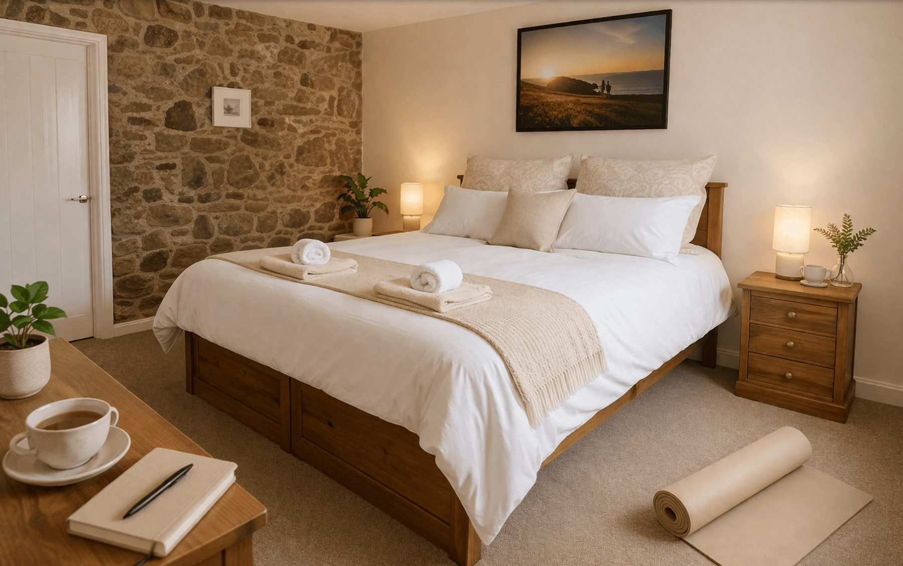

The retreat house

## Where do guests stay?

Home for the week is a historic farmhouse with a much-loved garden, a real home rather than a hotel. With only ten to twelve guests, the shared rooms fill with easy conversation, while quiet corners wait for the moments you would rather be alone.

</section>

<section class="qa">

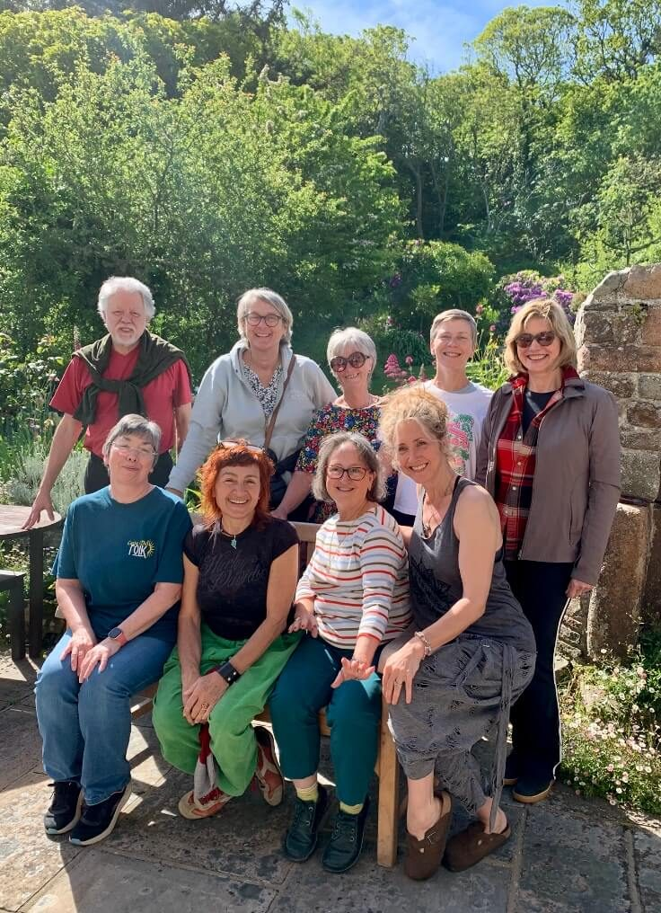

The outcome

## What can I expect from the week?

Your investment covers everything that matters: your room, the wellness facilities, all Bram and Pip's fabulous meals, daily yoga with Monica, and of course the island itself.

Every experience is personal. Many guests tell us they leave with better sleep, a slower pulse, and the feeling of rejuvenation that comes with escaping the 'treadmill' of modern life. We hope to have the opportunity to share this beautiful Island with you too. [See September dates and reserve your place](/retreats-on-sark), or explore the [digital detox](/digital-detox-retreat) and [burnout](/burnout-retreat) retreats.

</section>
