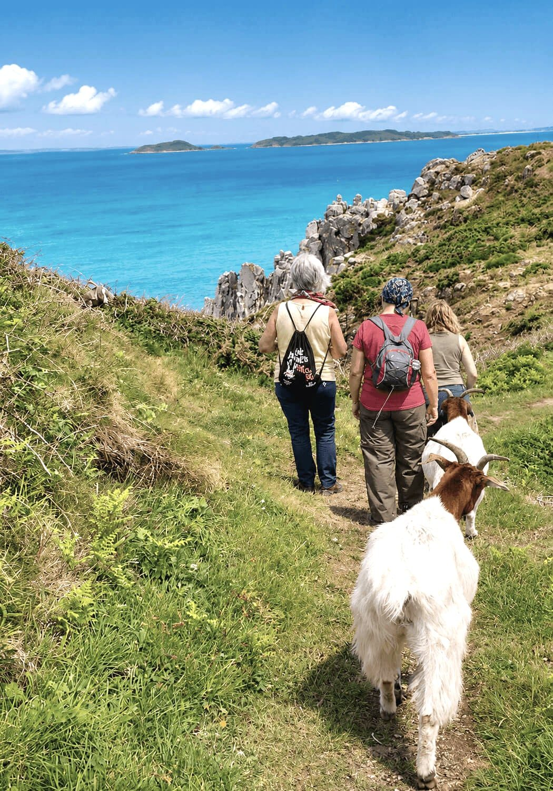
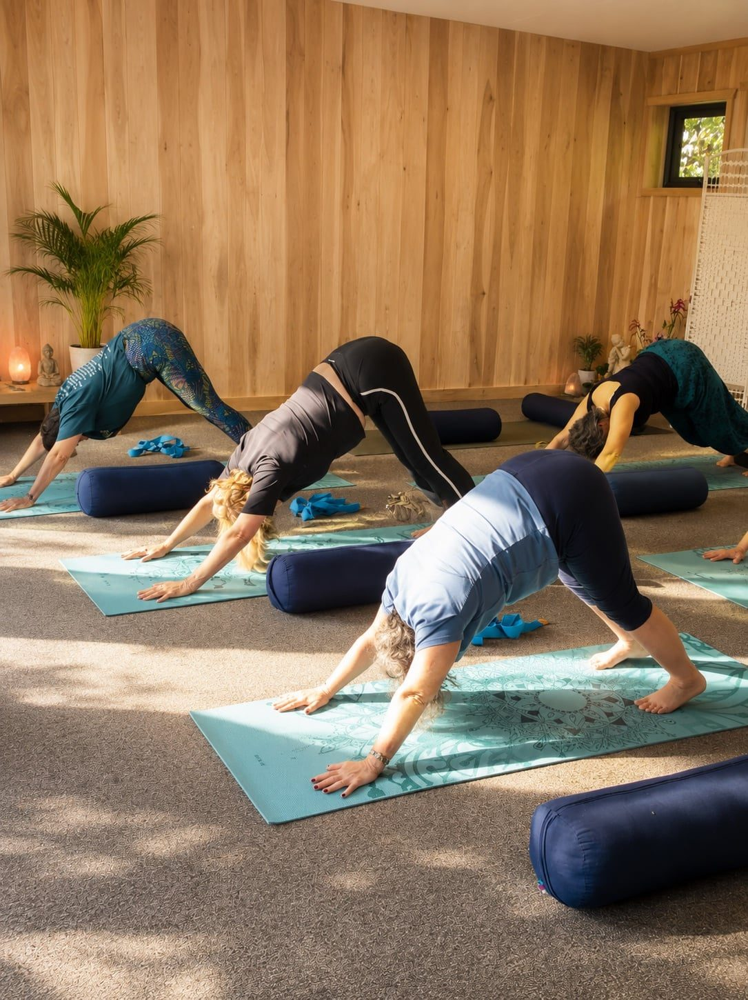
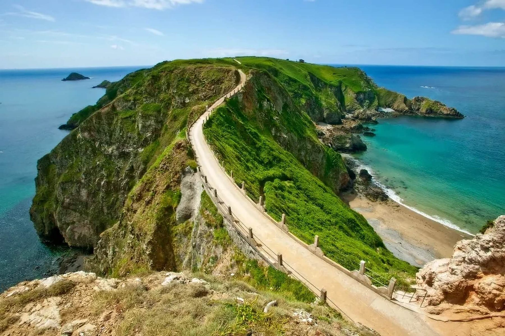
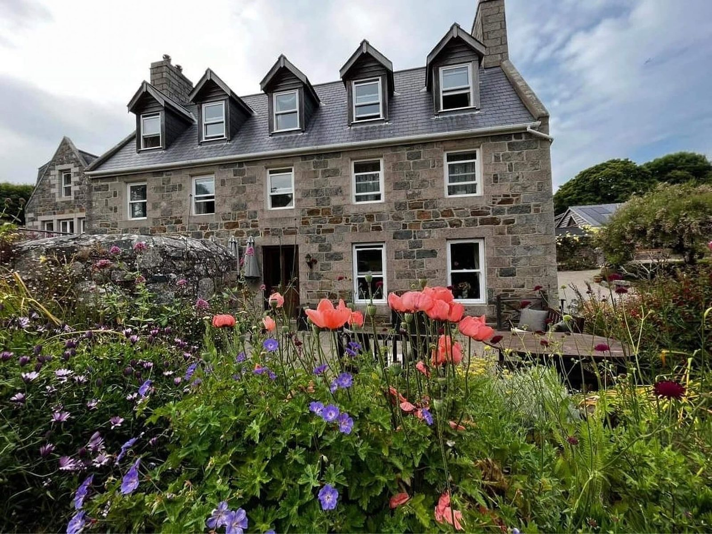
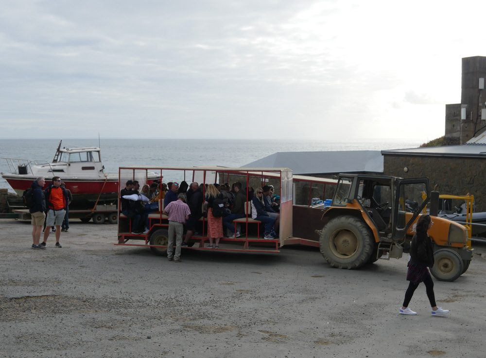
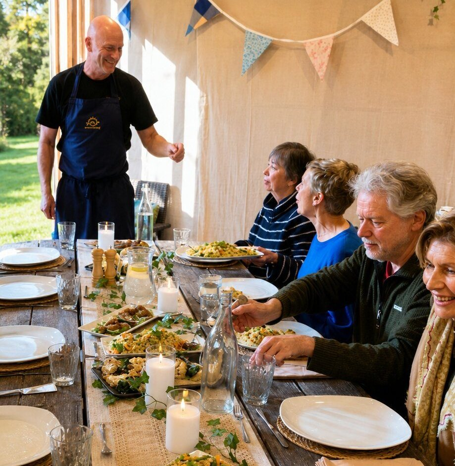

There are places that invite you to pause. <em>Sark is one of them.</em>

The island sits nine miles off Guernsey, reached only by boat. There are no cars for visitors, no traffic lights and no street lighting at all. Life here moves at the pace of the tide, the light and the lanes. It is the kind of quiet most people have not heard in years.

Our retreats bring ten to twelve guests to our historic farmhouse for five nights of yoga, coastal walking, shared meals and genuine rest. Whether you practise every week or have never stepped onto a mat, you will be welcomed exactly as you are.

**Next retreat: 12 to 17 September 2026.** Early booking rate £1,495 shared room until 19 July.

<a class="btn" href="/retreats-on-sark">Reserve my place</a>

<section class="qa">

The island

## Why a yoga retreat on Sark works

Most retreats take place somewhere beautiful. Sark offers something rarer.

This is one of the last places in Europe where daily life remains genuinely uncomplicated. People walk, cycle or travel by horse and carriage. The loudest thing you will hear on most afternoons is the sea. At night the island becomes one of the darkest inhabited places in the world, which is why Sark was named the world's first Dark Sky Island.

It is difficult to describe how quickly the nervous system settles when the background noise of ordinary life simply is not there. Guests often tell us they feel lighter within a day of arriving. The island does half the work of the retreat before the first class begins.

Read more about the island on our [Why Sark?](/why-sark) page.

</section>

<section class="qa rev">

The practice

## The practice, with Monica

Your teacher for the week is Monica of YogaMorphic, a senior yoga teacher with some thirty years of experience. Monica describes the week as an immersion rather than a course, and she means it. Sessions build gently across the five days, morning and evening, moving between breath, movement and meditation.

Every class is taught for mixed levels with options throughout. You do not need to be flexible. You do not need experience. Props, modifications and rest are always available, and nobody is behind.

</section>

<section class="qa">

The week

## More than yoga

A retreat is an opportunity to live differently for a few days. Your time on Sark includes:

Morning yoga to begin the day with intention. Coastal walks along some of the most dramatic cliff paths in the British Isles. Bram's vegetarian cooking, generous and seasonal, served family style around one long table. Free afternoons to swim, read, explore or do nothing at all. Evenings under skies clear enough to show the Milky Way as a textured band overhead.

Nothing is compulsory. The schedule is an invitation, not a timetable.

</section>

<section class="qa rev">

The retreat house

## Where you stay

Guests stay together in our historic farmhouse, a real home rather than a hotel, with a much-loved garden and quiet corners to disappear into. With only ten to twelve guests, the house becomes its own small community by the second day.

</section>

<section class="qa">

Arriving

## Getting here is part of it

Most guests fly into Guernsey, around 45 minutes from London, then take the passenger ferry to Sark, a crossing of around 55 minutes past the islands of Herm and Jethou. On arrival, a tractor-drawn "toast rack" carries you up Harbour Hill, and a horse and carriage brings you to the retreat house. By the time you arrive, the world you left already feels far away.

Our full travel guide answers every practical question: [Getting to Sark guide](/visiting-sark-for-a-wellness-retreat).

</section>

<section class="qa rev">

Dates & price

## Dates, price and what's included

**12 to 17 September 2026.** Five nights. Your place includes accommodation at the retreat house, all meals, daily yoga with Monica, guided walks and every retreat activity. No hidden extras once you are here.

Shared room, early booking: **£1,495** until 19 July 2026, then £1,695. Single room, early booking: £1,995.

<a class="btn" href="/retreats-on-sark">Reserve my place</a>

</section>
